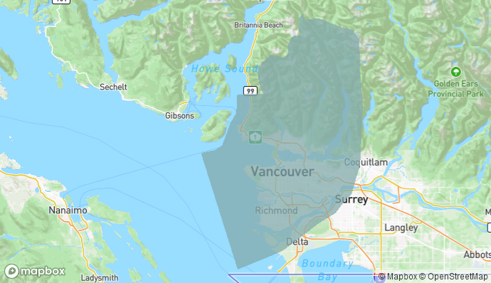

# Acknowledgements

## Workshop Website
This workshop was authored by Lily Demet and Alex Alisauskas.. 

Site template adapted from the [just-the-docs](https://github.com/pmarsceill/just-the-docs){:target="_blank"} Jekyll template created by [Patrick Marsceil](https://github.com/pmarsceill){:target="_blank"} and available under the [MIT License](http://opensource.org/licenses/MIT){:target="_blank"}

Copyright: UBC Library Research Commons, [Creative Commons Attribution 4.0 license](https://creativecommons.org/licenses/by/4.0/){:target="_blank"}

## Land acknowledgement

We'd like to acknowledge the indigenous lands where we are located. The UBC Vancouver campus is located on the traditional, ancestral, and unceded territory of the xʷməθkʷəy̓əm (Musqueam) peoples.

 
*Map of Musqueam territory from [Native Land Digital](https://native-land.ca/maps/territories/x%CA%B7m%C9%99%CE%B8k%CA%B7%C9%99y%C9%99m/)*

Please take a moment to explore [native-land.ca](https://native-land.ca/maps/native-land){:target="_blank"} so that you can visualize the Indigenous territories, languages, and treaties in your area.

<iframe src="https://native-land.ca/api/embed/embed.html?maps=territories&position=49.244770894278666, -123.16698232306474&key=AADlPNbKCBAepz816odRT" style="width:100%; height:400px; border:none;"></iframe>

