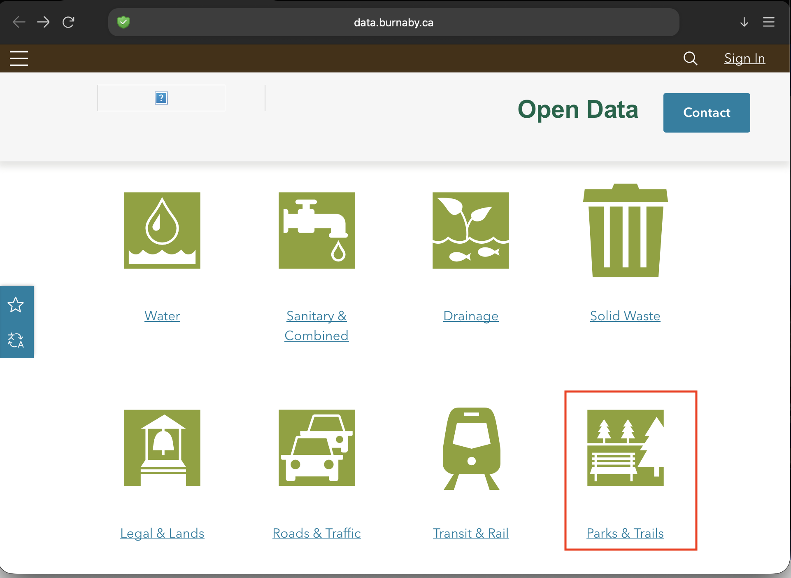
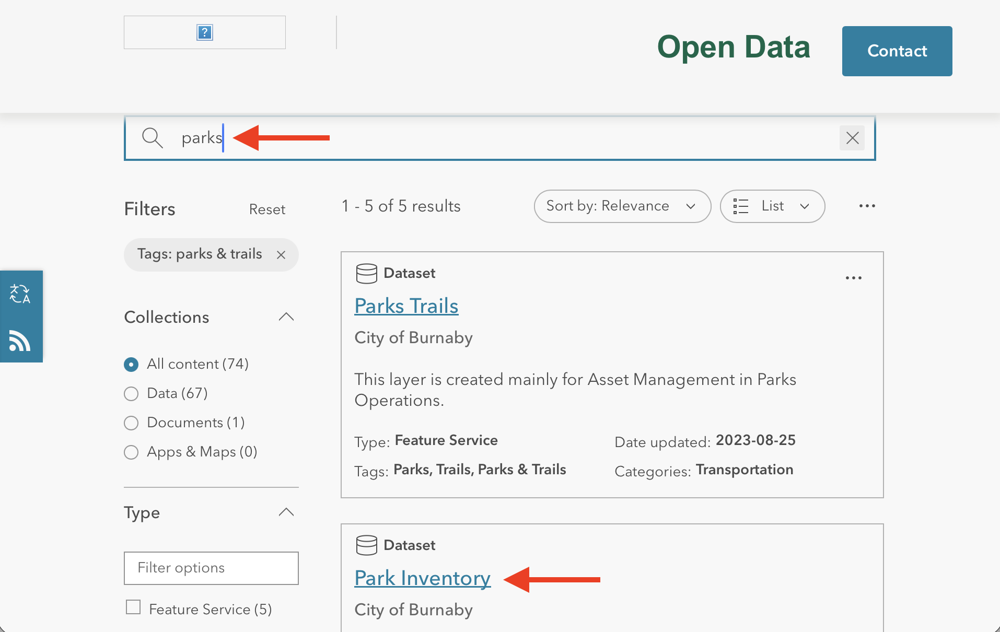
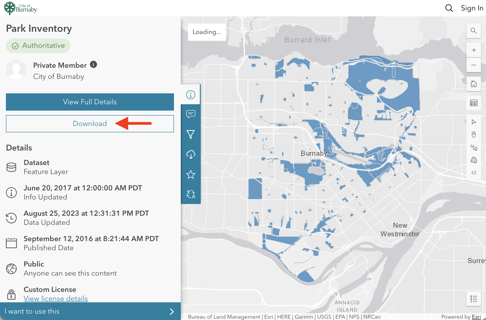
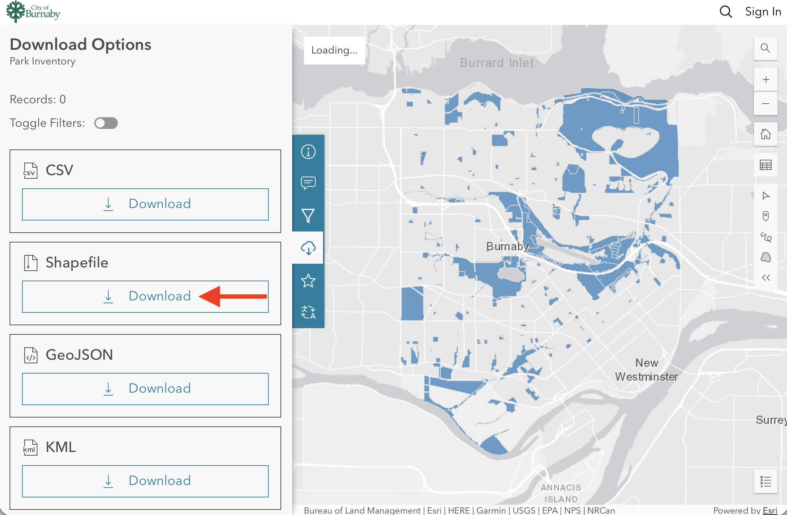

# Assembling Data
For this workshop, a handful of vector datasets of Vancouver have been provided for you. However, in the real world data will seldom be neatly prepared for you. Rather, you'll likely need to search for and download data from various web sources. For this reason, today's workshop will guide you through downloading vector data on city parks from a municipal data portal of your choice.  

----

## Given Data
Inside the `qgis-tools-workshop`  you should see the following files, along with their associated 'sidecar files' which contain vital metadata:

- `van-parks.shp`, polygon representations of Vancouver's [public parks](https://opendata.vancouver.ca/explore/dataset/parks-polygon-representation/information/){:target="_blank"}
- `burnaby-parks.shp`, polygon representations of Burnaby's [public parks](https://data.burnaby.ca/search?tags=parks%2520%2526%2520trails){:target="_blank"}
- `local-area-boundaries.shp`, [neighborhood extents](https://opendata.vancouver.ca/explore/dataset/local-area-boundary/information/?disjunctive.name){:target="_blank"} as designated by the City of Vancouver 
- `public-art.csv`, a CSV file containing point data for [public art](https://opendata.vancouver.ca/explore/dataset/public-art/information/){:target="_blank"} across the City of Vancouver
- `public-art-artists.csv`, a CSV file containing metadata on [the artists behind public art](https://opendata.vancouver.ca/explore/dataset/public-art-artists/information/){:target="_blank"} for the City of Vancouver
- `cultural-spaces.geojson`, a point layer of [cultural spaces](https://opendata.vancouver.ca/explore/dataset/cultural-spaces/information/?disjunctive.type&disjunctive.primary_use&disjunctive.ownership){:target="_blank"} across the City of Vancouver
- `census-tracts.shp`, [census tracts](https://www12.statcan.gc.ca/census-recensement/2021/geo/sip-pis/boundary-limites/index2021-eng.cfm?year=21){:target="_blank"} from Statistics Canada, clipped to only the City of Vancouver. 

 

## Practice downloading data... 
The following documentation demonstrates how to download data from the City of Burnaby's municipal open data portal. Each city's portal is different, and so downloading data platform to platform isn't always straightforward. It can be tricky to find the right buttons to press to download the right file format. Remember that if there's an interactive map visualizing geospatial data, there is likely a way to access and download the data in a spatial format (e.g., shapefile, geodatabase, or geoJSON). 

 

 

 

 

To Do
{: .label .label-green }
Practice downloading geospatial data for public parks of the city of your choice. Note that the dataset might not be named simply 'parks'; it could be 'parks and open spaces'. Download the dataset in either .geoJSON or shapefile format. Make sure to **Unzip the downloaded file if needed, and move it to your workshop folder.**

- [Burnaby](https://data.burnaby.ca/){:target="_blank"} 
- [Toronto](https://open.toronto.ca/){:target="_blank"} 
- [Victoria](https://opendata.victoria.ca/){:target="_blank"}  
- [Kelowna](https://opendata.kelowna.ca/){:target="_blank"} 
- [Kamloops](https://mydata-kamloops.opendata.arcgis.com/){:target="_blank"} 
- [Penticton](https://open.penticton.ca/){:target="_blank"} 
- [Halifax](https://data-hrm.hub.arcgis.com/pages/open-data-catalogue){:target="_blank"} 
- [Edmonton](https://data.edmonton.ca/){:target="_blank"} 
- [Montreal](https://donnees.montreal.ca/){:target="_blank"} 
- [Ottawa](https://open.ottawa.ca/search){:target="_blank"} 
- Or try another city of your choice. 

 

Before moving on, make sure all downloaded files are unzipped and moved to your `qgis-tools-workshop` folder.
{: .warn}

