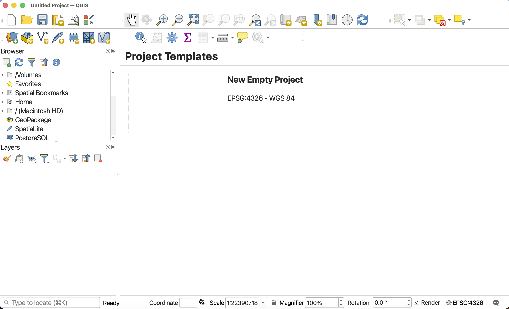
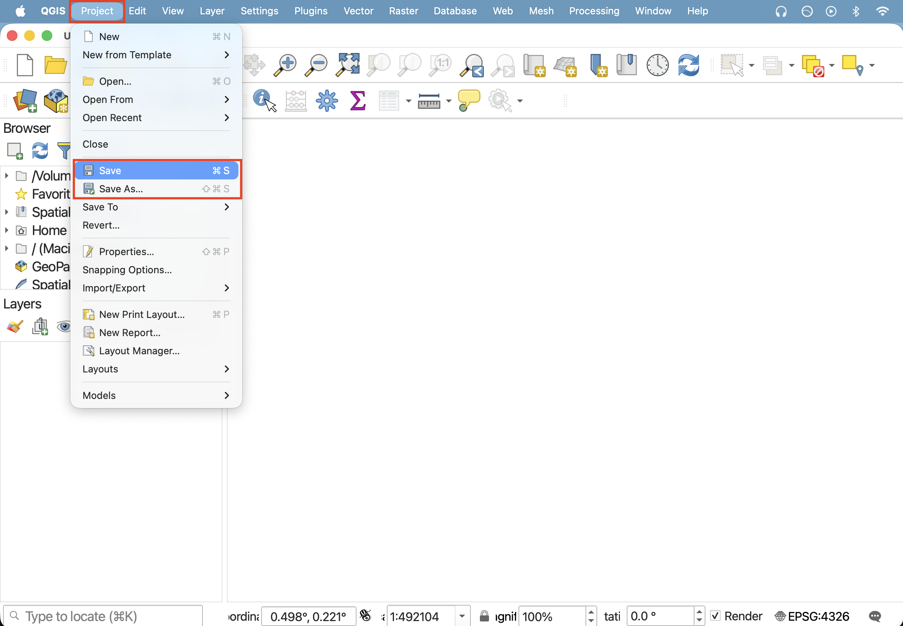
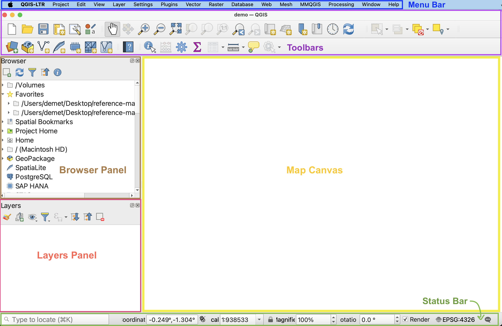
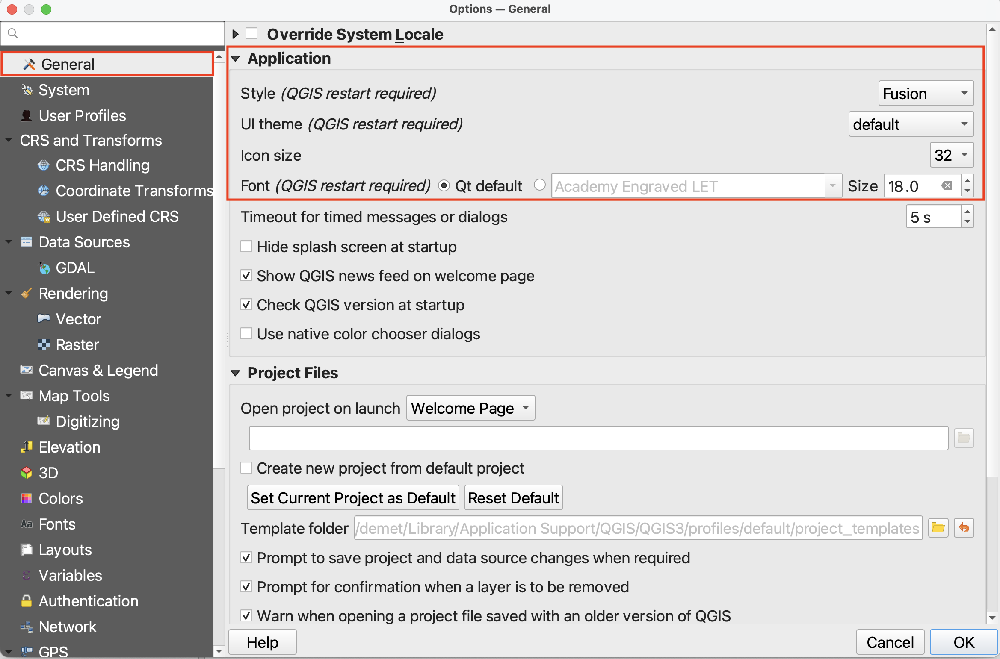
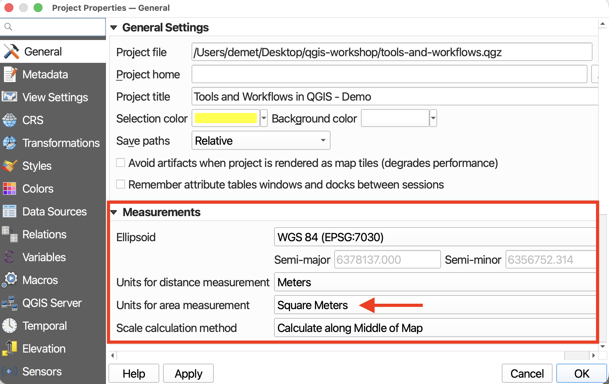

# Open & Save a new QGIS project

>   **Launch the QGIS application now!** If you have successfully downloaded and installed QGIS, the application should open and look like this:

>  **Click new empty project to begin.** 

 

To save your project, navigate to the `Project` Menu at the stop of your screen and go down to "Save". 

> - When you Save a project (or a dataset, for that matter), you need to give it both a *name* and a *location*. It's best practice to save your QGIS projects to the folder where you keep your data for the project. So: save the project to your  `qgis-tools-workshop` folder and give it a name such as `qgis-workshop_FirstnameLastname`. You'll notice the file extension is `.qgz`. You can learn more about QGIS file formats [here](https://docs.qgis.org/3.44/en/docs/user_manual/appendices/qgis_file_formats.html){:target="_blank"}.

Just like with documents in a text editor, you can also "Save As" to save your project as a new file, thus creating multiple back-up versions of an original.  It is important to regularly save your project while working in case QGIS crashes.
    

Moving forwards, you can also use the save icon in your **Toolbar** to save your project regularly. 

 

## Navigate the Graphical User Interface (GUI) 

- **Menus** - At the very top of your screen you’ll see menus which, when clicked on, expand to show many more options and even sub-menus. Notice that these menus are only visible when you’ve clicked into the QGIS application. Though you can drag the application interface around your screen, the menus stay at the top. If you click out of the QGIS application, the menu will disappear. These menus provide easy access to a variety of tools you’ll use in your everyday mapping. Like any new interface, it may take some time to become familiar with what’s stored where.

- **Toolbars** - The toolbar is the area at the top of your QGIS application with all the icons. The toolbar actually contains multiple toolbars, which are groups of icons that, when clicked, allow you to navigate around your map canvas, make click-based selections, edit layer geometries, create spatial bookmarks, and much more. You can customize this area of your GUI to fit your needs, adding and removing sets of tools by clicking on the great area of the toolbar.
   
- **Browser and Layers Panel** - When you open the project prepared for you, you should see two panels on the left-hand side of your interface. The browser panel lets you easily navigate your file system for data and project files. Your layers panel displays your project’s data layers and provides access to configuration settings. If you ever accidentally close a Panel, you can open it again by going to the View menu at the top of your screen, down to Panels, and then selecting the ones you wish. You can also right-click anywhere in the toolbar’s greyspace and select the Panels and Toolbars you want to show or hide.
    
- **Status Bar** - The status bar displays current information about the map canvas, and allows you to make adjustments in the map’s scale and rotation.
    
- **Map Canvas or Map View** - Call it either one. This is where the map is displayed and updated as layers are loaded. You can zoom/pan the map canvas as well as select features and other operations.

 

## Customizing the interface
You can change the look and feel of your GUI, as well as adjust default settings from the menu **QGIS-LTR --> Preferences** or the menu **Settings --> Options.** Both menus are located at the top of your screen when QGIS is open and the application is active (meaning you've clicked anywhere on it). 

The application Options window looks like the image below. Most customizations you'll want to make at this stage will be under "General".     

- **Light and Dark mode** - So long as your Style is set to Fusion and UI Theme is set to default, whether your QGIS application is light or dark depends on whether your computer System Settings have Appearance as light or dark. If you change your computer's Appearance settings, be sure quit (saving first, of course) and re-open your QGIS project for the changes to take effect. 

- **Increasing font and icon size** - Make sure to resize the Options dialogue window so you can see the drop-down for "icon size" and "font". (It is particularly difficult to see QGIS drop-down and close window icons in dark mode.) Now you can increase the font and/or icon size. Icon changes will happen as soon as you click OK. Changes in font size won't update until you quit and restart QGIS, so make sure you save your project now. 

 

<!--Double check this works if i then add some other dataset-->

## Project Properties
The [Project Properties](https://docs.qgis.org/3.44/en/docs/user_manual/introduction/qgis_configuration.html#project-properties){:target="_blank"} provide useful information about your QGIS project, such as it's Coordinate Reference System (CRS). Although the different data layers you add to a QGIS project may have different projections, QGIS will reproject everything 'on the fly' to match the Project CRS. Setting the project CRS doesn’t change the stored projections of each layer, only how they are rendered by QGIS. 

Under **General** properties, make note of the units for area measurement. 

    

We will come back to the Project Properties shortly. 

---
#### Resources for Project Setup
- [Exploring the Map View and Toolbar](https://docs.qgis.org/3.44/en/docs/user_manual/map_views/map_view.html#exploring-the-map-view){:target="_blank"}
- [QGIS GUI comprehensive documentation](https://docs.qgis.org/3.44/en/docs/user_manual/introduction/qgis_gui.html#qgis-gui){:target="_blank"}
- [QGIS Configuration](https://docs.qgis.org/3.44/en/docs/user_manual/introduction/qgis_configuration.html#){:target="_blank"}
- [QGIS Project Properties](https://docs.qgis.org/3.44/en/docs/user_manual/introduction/qgis_configuration.html#project-properties){:target="_blank"}
