# Load data to your new QGIS Project 
{: .no_toc}

Once you've created and saved a new QGIS Project, it's time to add your data. This page will guide you through loading vector data as well as a CSV layer to QGIS. 

  

    Page Contents
  

  {: .text-delta }
 - TOC
{:toc}

----

## Loading Vector Data

There are a couple ways to add data to your map canvas. 

- **Browser panel** From the Browser panel, likely docked to the left of your screen, expand the `Home` directory (aka folder) and navigate to your workshop data folder. Expand that folder to see the data inside, then double-click or drag and drop each file to add it to your project. Alternatively, you can add a **Favorite** connection in the Browser panel to save you the trouble of finding your data folder. To do this, click “Favorites” at the top of the Browser panel's list and connect the workshop data folder as a favorite directory. Make sure not to click *into*, merely select it. 
- **Data Source Manager** The Data Source Manager is the same sort of portal as the Browser, just in a separate dialogue box rather than a docked panel. You can open the Data Source Manager by double-clicking the 3 colorful squares icon in the Toolbar, or from the Layer menu at the top of your screen.
- **Layer menu** A third way to add layers to your map canvas is through the Layer menu at the top of your screen. Under Layer, navigate to **Add Layer** (it should be the third item down) and select Add Vector Layer... or Add Raster Layer.... This will open the same Data Source Manager dialogue box as before.
- **Drag and drop** files from your data folder directly onto your map canvas.     

To Do
{: .label .label-green }

Because our data is all organized in a single folder, we you can drag and drop to add our vector data to your project. Or, establish a Favorite Directory connection in the Browser Panel.  

> Add your vector data to your QGIS project in the following order:

>- `local-area-boundaries.shp`
- `census-tracts.shp`
- `van-parks.shp`
-  `burnaby-parks.shp`
- The parks you downloaded yourself
- `cultural-spaces.geojson`

> Accept any transformation warnings. 

> You should see the layers add to your screen. 

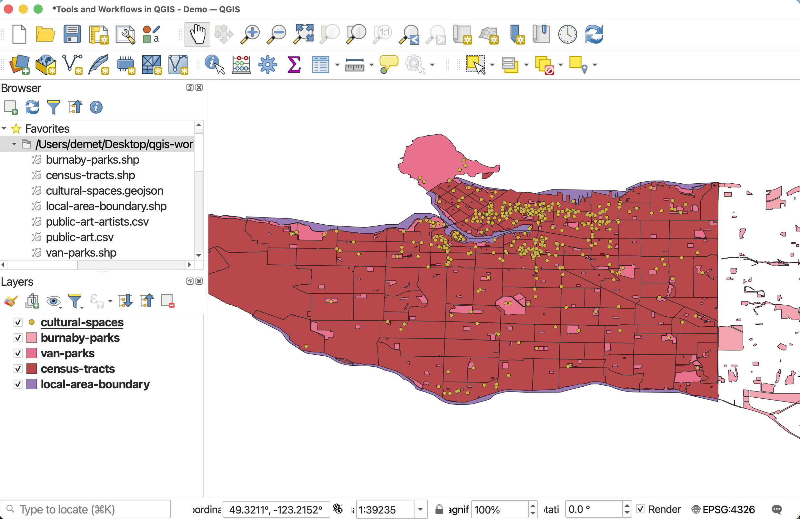

 

### Set the Project CRS

Your map might look a little wonky or warped. This is a projection issue. Each spatial dataset you add as a layer to your QGIS comes with it's unique CRS, or Coordinate Reference System, which tells GIS how to visualize information pertaining to the 3-dimensional Earth in the 2-dimensional screen-space of your computer. Representing the earth in two dimensions necessarily involves distortion. While there are numerous Coordinate Reference Systems available (and you can even create your own), each has it's advantages given what is being mapped — the whole world, a specific country or city, the polar regions, ocean navigation, area comparisons, etc. — because of their differential preservation of distance, direction, area, size, angles, and/or shape. 
<!-- A CRS is comprised of a Geographic Coordinate System (Datum, measured in decimal degrees) and a Projected Coordinate System (Projection, distance measured in metric units).  -->

Now it's is not unusual to add multiple layers to a QGIS project, each having a different CRS. The trick is to set your QGIS Project CRS to the CRS best suited to your location and topic of mapping. That way, QGIS will reproject all the project layers "on the fly" to match a single projection. Note that this doesn't change the CRS of individual layers — it simply reprojects them while they are inside this one specific QGIS Project. 

The reason your map looks warped is because QGIS automatically sets the Project CRS to the CRS of the first loaded layer. Let's go ahead and see what that projection was, and change it so our map looks a little less wonky. 

 

To Do
{: .label .label-green }

You can access the Project Properties from the the **Project** menu at the top of your screen. 

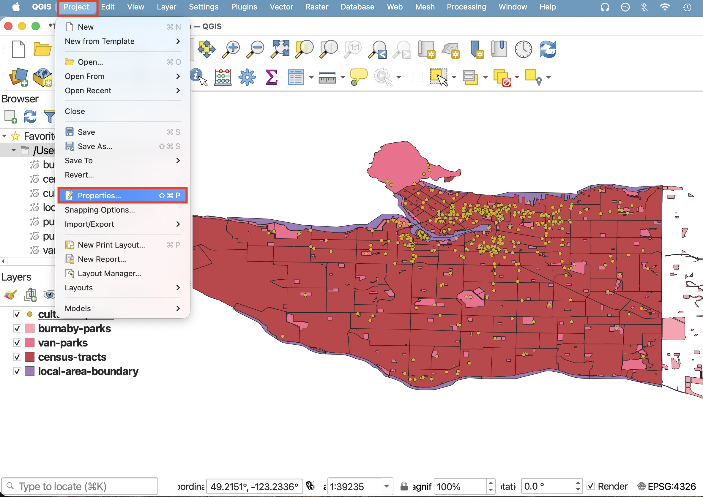

 

> Open the Project Properties and click down to **CRS**. You can see the current project CRS is set to `WGS 84`. You can see by the little map that this CRS is good for the whole Earth, but causes distortions to our data when zoomed-in at small scale. This is specifically because `WGS 84` uses latitude and longitude for coordinates whereas our data has been 'projected' into metric distance. 

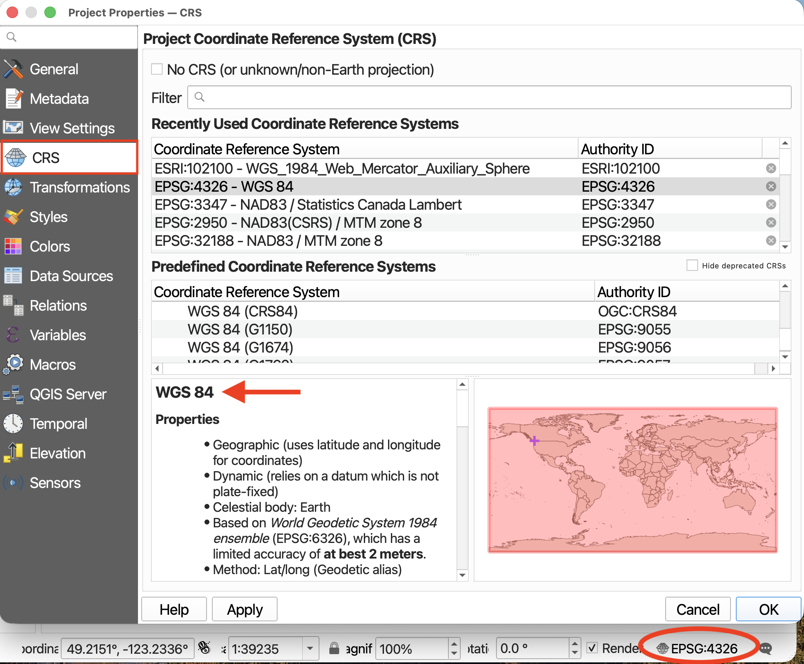

Note: You can also see the same CRS, although designated `EPSG:4326`, is visible in your main interface Status Bar. You can always click on the CRS in your Status Bar to bring you to your Project CRS. 

 

> Let's first change the CRS to something specific to Vancouver. In the Filter searchbar at the top of the window, copy/paste in the following CRS: `NAD83 / UTM zone 10N`. 

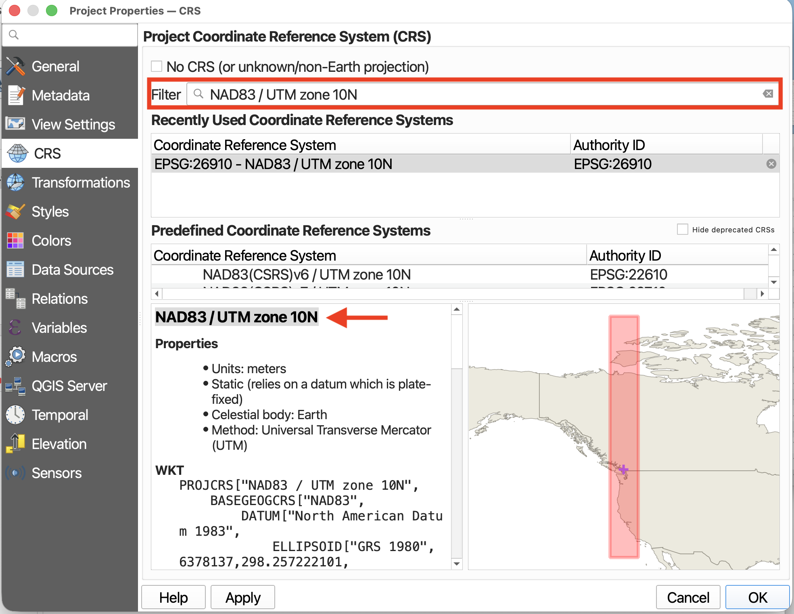

> Click **OK** and your map should already look better. 

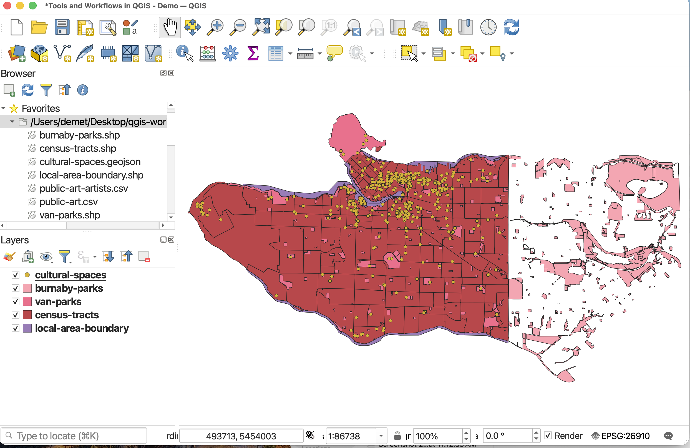

<!-- ensure the project coordinate reference system (CRS) is set to `WGS_1984_Web_Mercator_Auxiliary_Sphere`. 

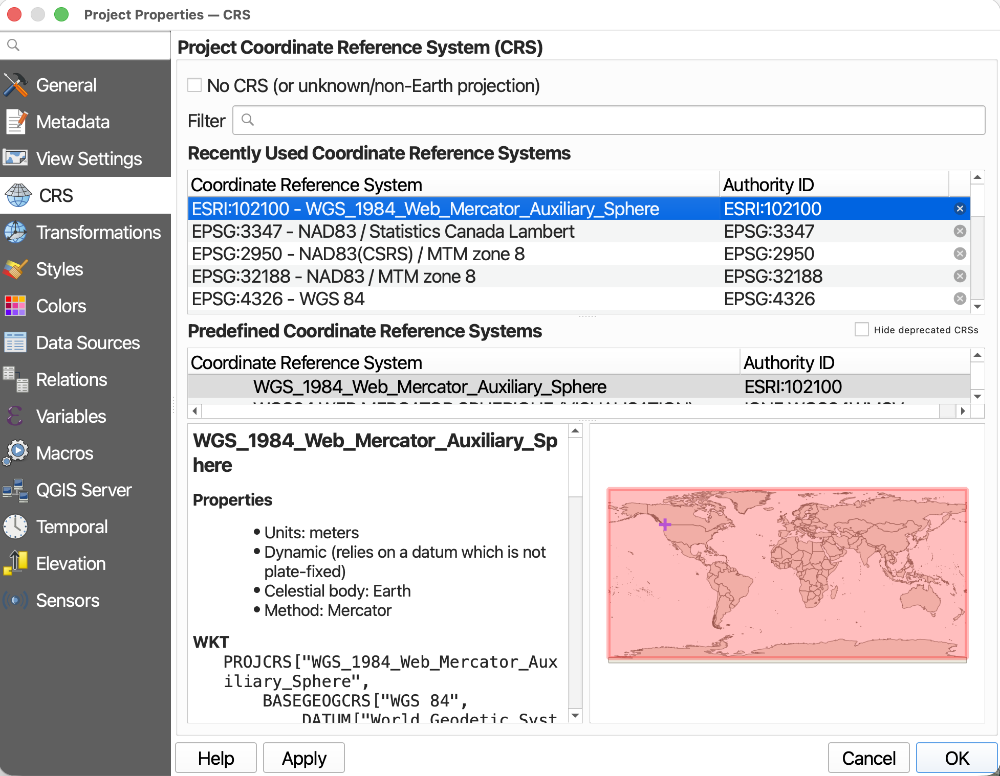 -->

 

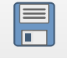 Before continuing, SAVE your project. 

 

## Loading CSV data to QGIS
If you try and drag `public-art.csv` or `public-art-artists.csv` to your map canvas, nothing will show up and the layer will look different in your Layers panel. That's because these two files are formatted as CSVs.

Tabular data stored in CSV (comma separated value) files can be uploaded to a GIS and rendered spatial so long as latitude and longitude are given in two distinct columns and their values stored as numbers. *Tabular data must be in a CSV file format with latitude and longitude stored as numbers in two separate columns before uploading to QGIS.* 

To Do
{: .label .label-green }

>  From the **Layer** menu at the top of your screen, go to **Add Layer** -> **Add delimited text layer…**

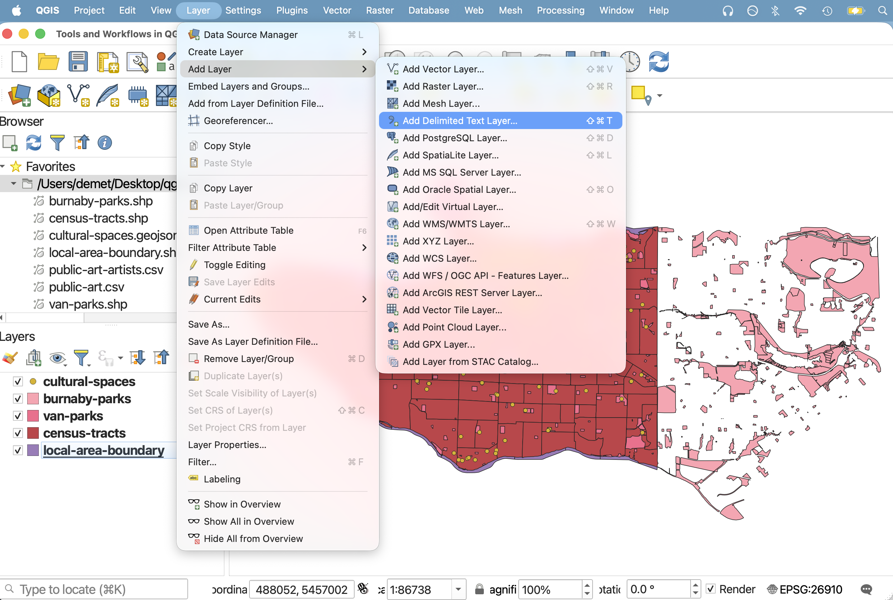

 

>  The Data Source Manager will open. Click the three dots `...` beside **File name** to navigate to `public-art.csv` and select it.

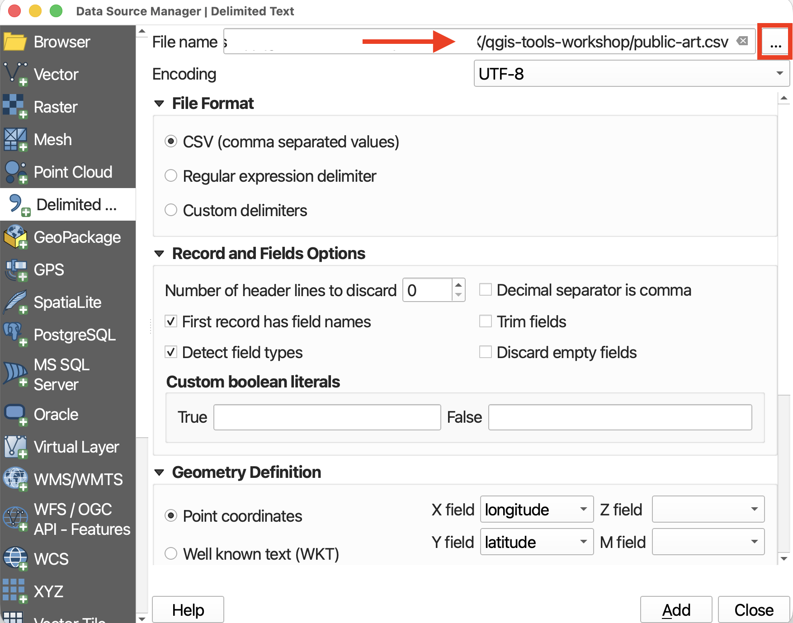

 

>  Scroll down to **Geometry Definition**, and ensure **Point Coordinates** is selected. Ensure the X field is set to longitude and the Y field is set to latitude. This may seem counter intuitive, but consider what values change as you move towards the north or south pole. As you move up or down towards the north or south pole — in other words, as you change along the Y-axis — you are changing latitudes. If you move east to west around the globe - constituting change in the X-axis direction - you are changing longitude. When uploading CSV data, it is important to know what CRS it was gathered/downloaded in. Since this dataset was downloaded from the City of Vancouver in `WGS 84`, you can keep the default Geometry.  

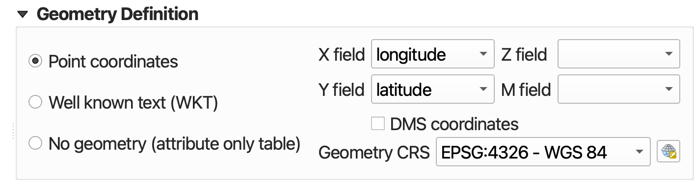

 

> Now look below to the **Sample Data** section. This gives a preview of your dataset. The data is difficult to see because you cannot expand it, but scroll horizontally until you reach the last two fields (or whichever fields contain your personal data’s latitude and longitude). If you scroll vertically (I recommend using the up & down arrows, otherwise you may accidentally change the field type), values will be revealed line by line. Ensure the columns for latitude and longitude are being read as Decimal (double), *not* text. 

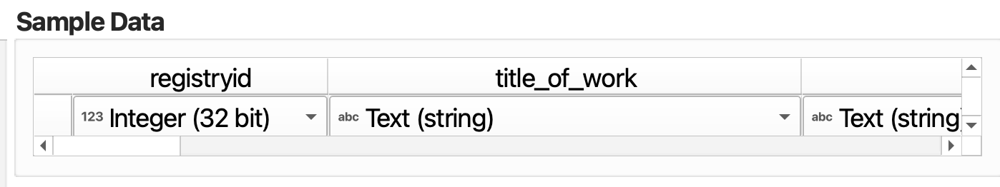

 

> Scroll over and set the `yearofinstallation` field to **Date** data format.

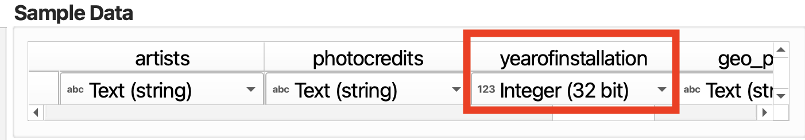
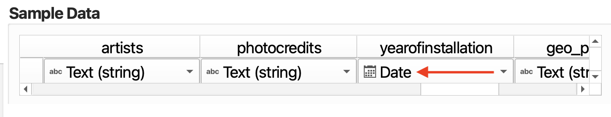

 

>  Now click **Add** at the bottom right-hand corner to add your CSV as a spatial layer to your map. Once you add the layer, the Data Source Manager will not go away, so you’ll have to close it. `public-art` should now be added to your map canvas.

>  **Zoom-to** the new layer.  

 

<!-- ONE LAST THING - SAVE AND EXPORT AS GEOJSON - MUST BE SHAPEFILE TO DO EDITS LATER ON. though merging with csv might work (since artists-cvs data) think about this - when to bring up compatability and attribute table editing.  -->

> There is one last step. Importantly, this file is still a CSV. It's simply been spatialized by QGIS. In order to edit the file, you'll have to export it in a geospatial file format such as a GeoJSON or Shapefile. To export a layer, right-click the layer and go to "Export". Then give it a name and location by clicking the tree dots next to the Layer Name input. Change the file format to GeoJSON. Because this file is point data containing coordinate data, we will set the CRS to `WGS84`. 

> Drag the new spatial layer of `public-art` to the top of your Layers panel, and remove the CSV from your map. 

 

 
Your data isn't saved _inside_ your QGIS project. Rather, the *filepath connections* are saved, as well as any modifications to symbology made to the layers in QGIS. When mapping in QGIS, it's important to keep track of where the data you're working with is stored. If you move your data, QGIS won't know where to look for it and a red exclamation mark will appear in the Layers Panel. You can click on this warning to tell QGIS where the data is now stored. 
{: .note}

 

## Managing and Interacting with Layers
{: .no_toc}

For a review of how to interact with Layers and stay organized, please see our [Intro to Mapmaking with QGIS](https://ubc-library-rc.github.io/gis-mapping-intro/content/project-setup.html#managing-layers){:target="_blank"} resource which was a prerequisite for attending this workshop. 

<!-- ## Interacting with Layers

- 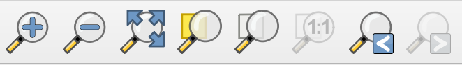 Take a moment to zoom in and out using the **Magnification tools** in your **Toolbar**.  

- 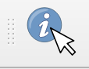To use the Identify tool, click the tool icon in the **Toolbar**, then, with the layer of interested highlighted in your Layers Panel, click on any feature. This will pull up the tabular data associated with that feature (the "row" in the Attribute Table). Use the **Identify tool** to look up the neighborhood names of the layer for Montréal. 

- 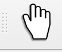 To stop the Identify tool, close the pop-up window and click the **Pan tool**.

 
  -->

<!-- ## Managing Layers -->
<!-- Although this map has only a handful of layers, some projects require you to juggle more than 10 layers. Having strategies to stay organized is therefore important. 

Note that we added layers to our project in a very specific order. This is because QGIS will render layers from the top down, meaning the layers to the top of your Layers Panel list will sit above the layers below. 

### Locating Layers
{: .no_toc}
- Layers in your Layers Panel will render in order from top to bottom. If you cannot see a layer added it's likely a) underneath another layer b) invisible or c) out of frame. Locate the layer you want to look at in your Layers Panel and try dragging it to the top of your list. Ensure the box to it's left is checked. You can hide a layer at any time by un-checking the box beside it. If you still don't see it, control-click (right-click) the layer and "zoom to Layer(s)". 
- Sometimes you will might download a new dataset into your data folder but it won't appear in your folder within the Browser Panel. If this happens, try **refreshing** your directory connections in your Browser Panel either by clicking the Refresh icon or by control-clicking the folder in question.
- If you move your data to a different folder location you will get an error when you next open your QGIS Project. Either allow QGIS to auto-find it, connect the new folder location, or move the data back.

Additionally, layers that cover the entire earth are quite large and require lots of processing power to load anew each time you pan and zoom around your map canvas. Best practice is therefore to "hide" or "turn off" layers you aren't using so as not to slow your computer down. Below are some tips to stay organized.

- **Layer Visibility** Layers in your Layers Panel will render in order from top to bottom. If you cannot see a layer added it's likely a) underneath another layer b) invisible or c) out of frame. Locate the layer you want to look at in your Layers Panel and try dragging it to the top of your list. Ensure the box to it's left is checked. You can hide a layer at any time by un-checking the box beside it. If you still don't see it, control-click (right-click) the layer and "zoom to Layer(s)". 

You can reorder your layers at any time by dragging them up or down. 

     > Drag `public-art` to the bottom of your Layers Panel. See how it disappears? Now drag it all the way to the top.
     > Re-order your layers as necessary so each one is visible. 

### Locating Layers
{: .no_toc}
- Layers in your Layers Panel will render in order from top to bottom. If you cannot see a layer added it's likely a) underneath another layer b) invisible or c) out of frame. Locate the layer you want to look at in your Layers Panel and try dragging it to the top of your list. Ensure the box to it's left is checked. You can hide a layer at any time by un-checking the box beside it. If you still don't see it, control-click (right-click) the layer and "zoom to Layer(s)". 
- Sometimes you will might download a new dataset into your data folder but it won't appear in your folder within the Browser Panel. If this happens, try **refreshing** your directory connections in your Browser Panel either by clicking the Refresh icon or by control-clicking the folder in question.
- If you move your data to a different folder location you will get an error when you next open your QGIS Project. Either allow QGIS to auto-find it, connect the new folder location, or move the data back. 

 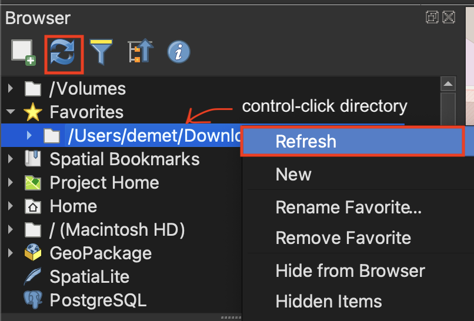 

### Set project CRS
if added parks data elsewher e---  -->

---
#### Resources for Data Wrangling
{: .no_toc}
- Spatial data is stored in a variety of file formats. See the [QGIS Documentation for Opening Data](https://docs.qgis.org/3.44/en/docs/user_manual/managing_data_source/opening_data.html){:target="_blank"} to learn more. 
- [Working with Spatial Data](https://projects.lincolnmullen.com/spatial-workshop/spatial-data){:target="_blank"} by Lincoln Mullen
- [Concordia's Guide to geospatial data](https://www.concordia.ca/library/guides/geospatial-data/geodata.html){:target="_blank"}
- [Creating data freehand with geojson.io](https://ubc-library-rc.github.io/gis-dhsi/content/day1/5-data-wrangling.html#creating-data-freehand-with-geojsonio){:target="_blank"}
- [Terrastories](https://terrastories.app/){:target="_blank"}, a tool by [Awana Digital](https://awana.digital/mapeo){:target="_blank"}, is a great resource for collecting place-based data on the go.
- [ArcGIS Survey 124](https://survey123.arcgis.com/){:target="_blank"} allows you to collect surveys with spatial information. 
- [Creating a new shapefiles in QGIS](https://ubc-library-rc.github.io/gis-reference-mapping/content/hands-on8.html){:target="_blank"}
- [Considerations for downloading data](https://ubc-library-rc.github.io/gis-spatial-stories/content/resources-for-data-assembly.html){:target="_blank"} 
- [Geocoding in QGIS](https://programminghistorian.org/en/lessons/geocoding-qgis){:target="_blank"}
- Tutorial on [Spreadsheet Skills](https://handsondataviz.org/spreadsheet.html){:target="_blank"} from [Hands-On Data Visualization](https://handsondataviz.org/){:target="_blank"} by Jack Dougherty & Ilya Ilyankou 