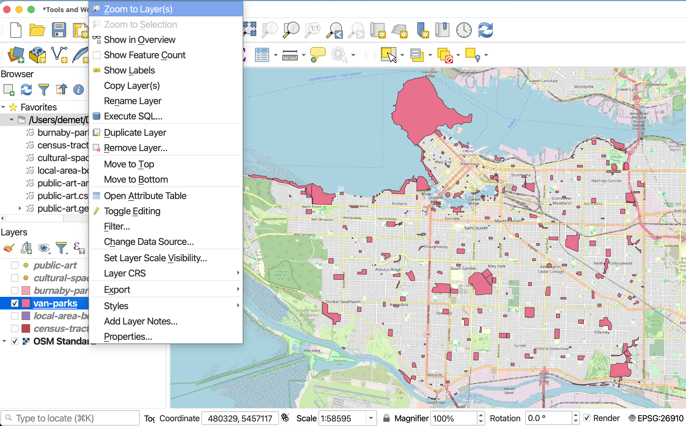
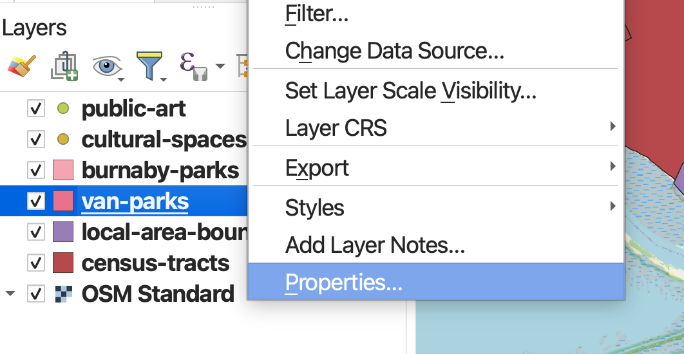
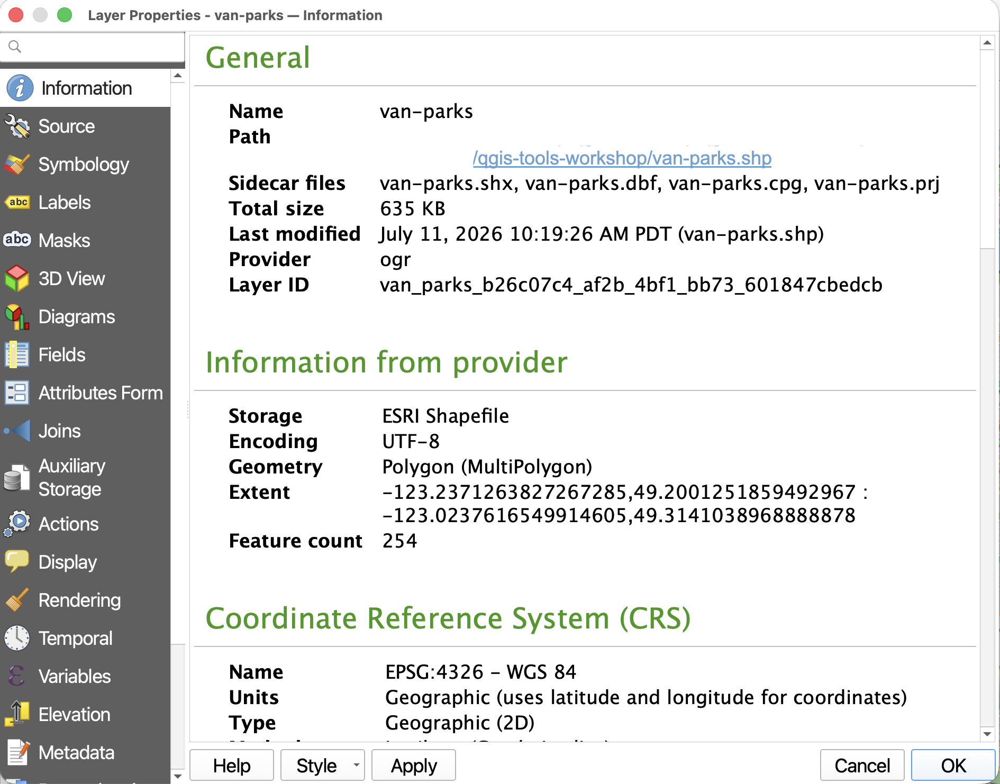
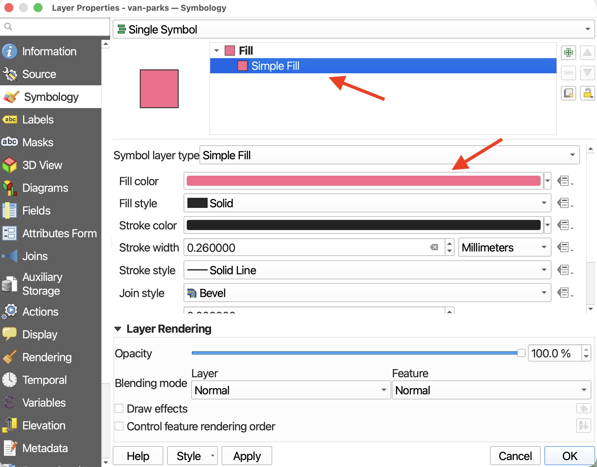
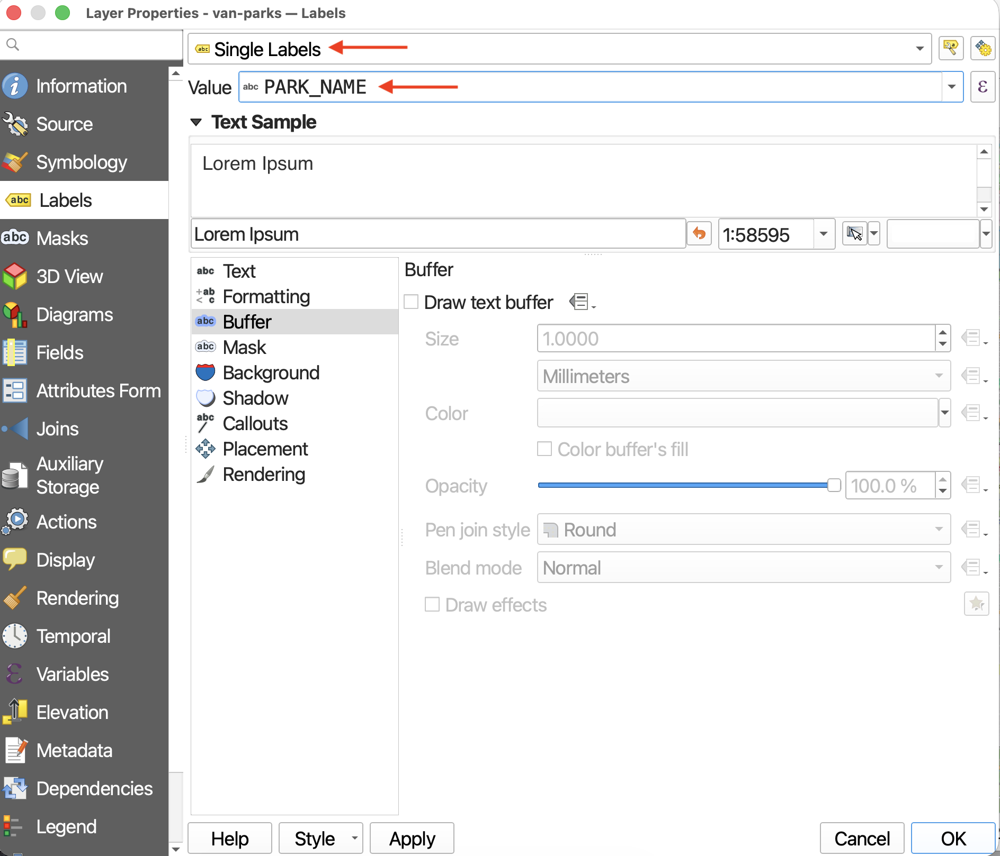
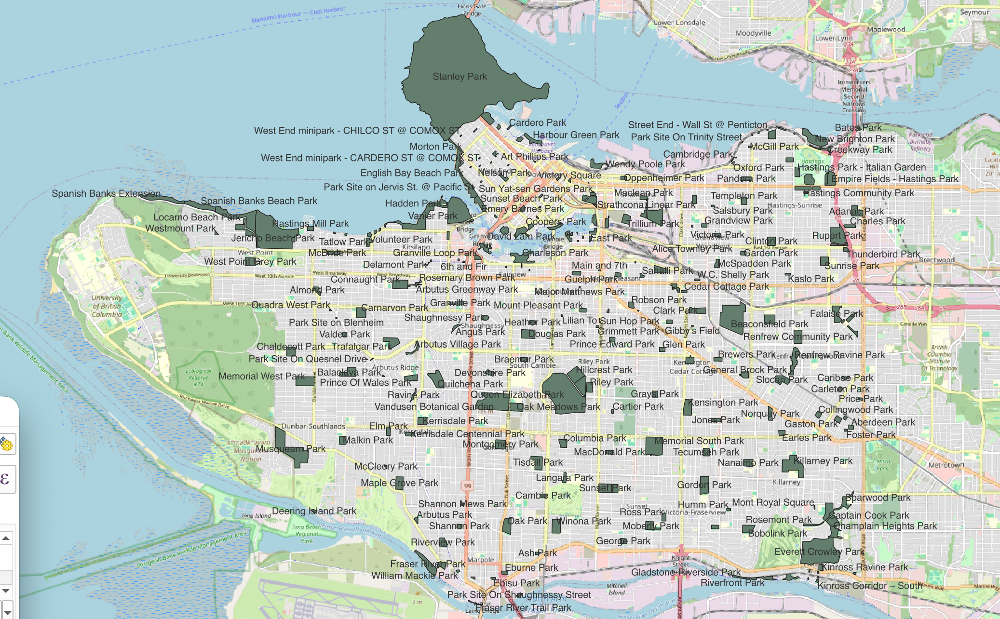
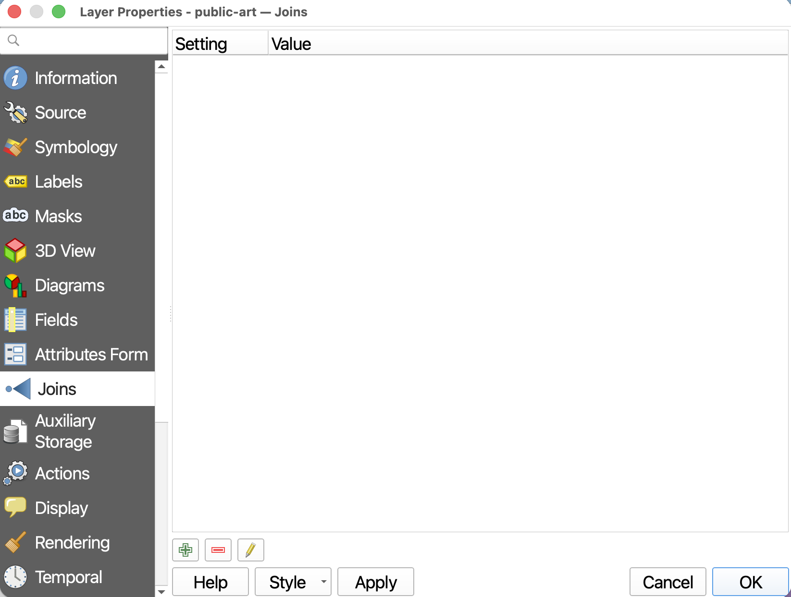
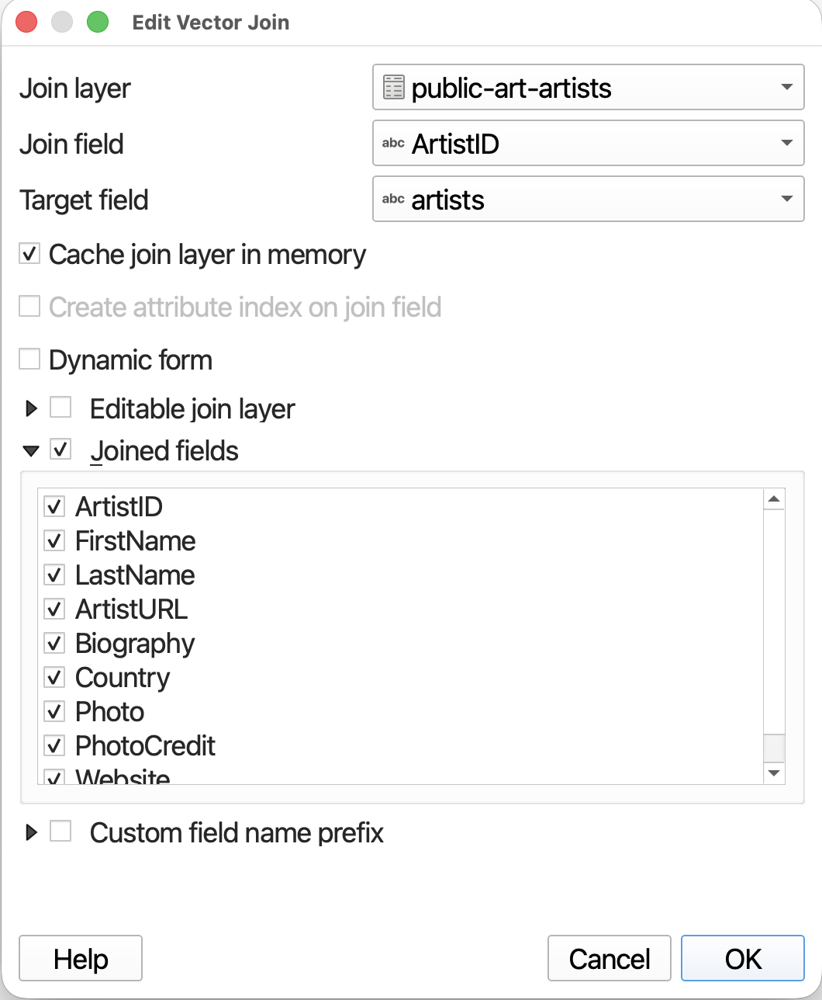

# Layer Properties

> In your **Layers Panel**, zoom to the parks data you downloaded yourself. The workshop material will use Vancouver parks for demonstration. 

If your parks are far away from Vancouver, you might encounter some distortion of the basemap due to the project projection being ill-suited for your area of interest. That's okay. You can also play around with changing the project projection (from the status bar) to something that works for the whole world (and thus the basemap), such as `WGS_1984_Web_Mercator_Auxiliary_Sphere`.
{: .note}

 

> Now, control-click (right-click) your parks layer again but this time open its **Properties**. 

 

While today's workshop won't explore Layer Properties in detail, it's important to know how to access the [Vector Properties Dialogue](https://docs.qgis.org/3.44/en/docs/user_manual/working_with_vector/vector_properties.html#){:target="_blank"}. 

[**Information**](https://docs.qgis.org/3.44/en/docs/user_manual/working_with_vector/vector_properties.html#information-properties){:target="_blank"} and [**Source**](https://docs.qgis.org/3.44/en/docs/user_manual/working_with_vector/vector_properties.html#source-properties){:target="_blank"} will contain metadata for the layer, including the dataset's Coordinate Reference System (CRS). [**Joins**](https://docs.qgis.org/3.44/en/docs/user_manual/working_with_vector/vector_properties.html#joins-properties){:target="_blank"} is useful if, for example, you wanted to load a csv file to your QGIS project with additional descriptive data for parks but no geospatial coordinates.

 

## Symbology
[Symbology](https://docs.qgis.org/3.44/en/docs/user_manual/working_with_vector/vector_properties.html#symbology-properties){:target="_blank"} is where you can change how your layer is symbolized and rendered. Currently, the symbology for parks is set to **Single Symbol** meaning every park is symbolized the same. 
    
To Do
{: .label .label-green }

> Try changing the symbolization of all parks by clicking the color bar and choosing a different color from the dialogue box that opens. Click **Apply** in the lower left-hand corner of the **Layers Properties** dialogue window to see the color update on your Map Canvas. When you are content with your changes, click **OK**.

 

Note that you can also access a layer's symbology from the **Layers Panel** by selecting the layer and then clicking the symbology icon in the Layers Panel, or by just clicking the little symbol next to a layer.

 After adjusting your symbology, SAVE your project.

 

## Labels
[**Labels**](https://docs.qgis.org/3.44/en/docs/user_manual/working_with_vector/vector_properties.html#labels-properties){:target="_blank"} will assign labels to your features based on an attribute value. 

To Do
{: .label .label-green }
Add labels for the names of parks to your map. 

> From the **Labels** layer property, change `No Labels` to `Single Labels`. 

> Then assign the value to that which most plausibly contains the parks' names. 

 

> Click **Apply** and check your map canvas. This might be overwhelming. Change the labelling of parks back to `No Labels`. 

 

## JOIN
Joins create a connection between two layers, appending the attribute information from one layer to another. To add a join, there must be a shared field between the two layers that matches exactly. 

Let's join the information on artists from the file `artist-info.csv` to our spatial layer, `public-art`. 

To Do
{: .label .label-green }

To add a join, go to the Layer Properties of the layer you want to append information *to*. 

>* Drag `artist-info.csv` to your QGIS Project. 

>* Open the Attribute Tables of both `artist-info` and `public-art`. Which Fields match? Are they both formatted the same data type?

>* Open the **Properties** of `public-art` and go to the **Joins** property. You'll see there are no current joins to this layer. Click the green plus icon to add a new join.

A new window will pop up. This window is easily lost behind other QGIS windows.

 

>* The **Join layer** will be `artist-info`
>* The **Join field**, the field of `artist-info` that matches one in `public-art`, will be `ArtistID`
>* The **Target field** will be `artists`
>* IMPORTANTLY, Check **Joined fields**. Here' you can select which fields you want to join from `artist-info`. 

 

 

>* Click **OK** and **OK** again to run the **Join**. 

>* Open the Attribute Table of `public-art` to confirm the Join was successful. You can remove a join at any time. 

 

SAVE your project. 

<!-- ---
#### Resources for further exploration
- [Comprehensive descriptions for all Vector Layer Properties](https://docs.qgis.org/3.44/en/docs/user_manual/working_with_vector/vector_properties.html#){:target="_blank"}
- [Working with Vector Data in QGIS](https://docs.qgis.org/3.44/en/docs/user_manual/working_with_vector/index.html){:target="_blank"} -->