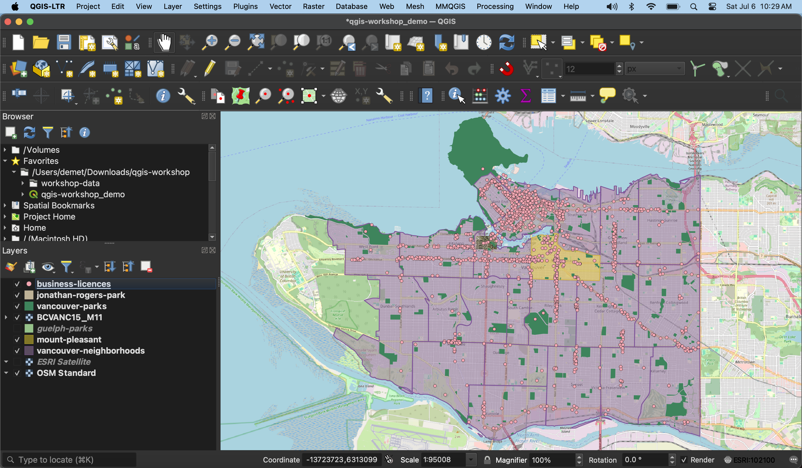
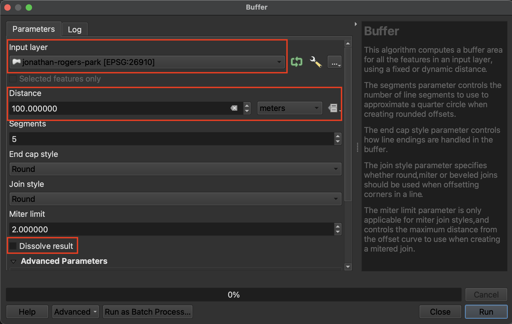
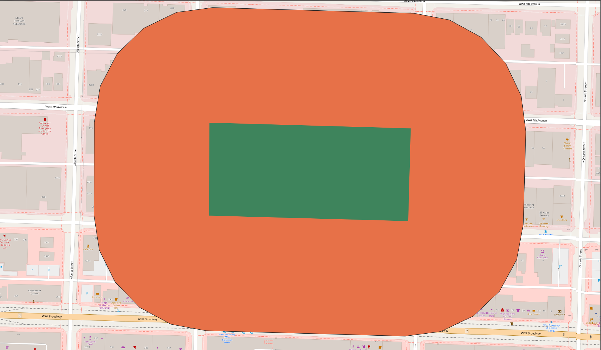
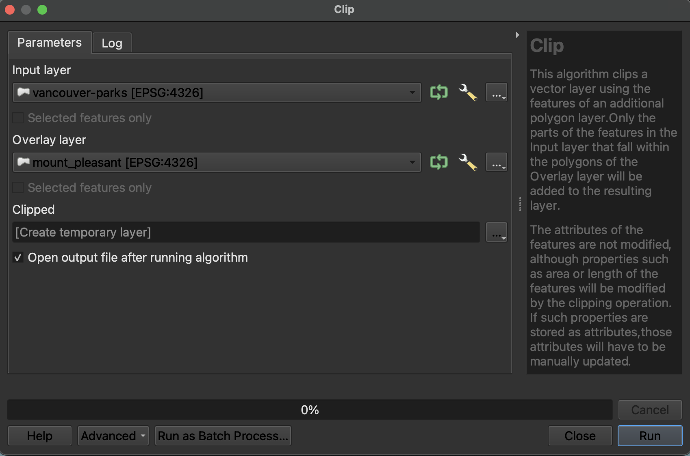

# Vector Tools

This page will introduce some common vector tools for spatial analysis workflows. Vector tools can be searched for in the **Processing [Toolbox](https://docs.qgis.org/3.44/en/docs/user_manual/processing/toolbox.html){:target="_blank"}** which can be opened from the **Processing menu** at the top of your screen. They can also be accessed from the **Vector** menu, where they are grouped by task: Geoprocessing, Geometry, Analysis, Research, and Data Management. 

>### Geoprocessing 
>{: .no_toc}
>Geoprocessing tools are useful for modifying the spatial extent of features, particularly in relationship to other layers. Geoprocessing is often done in the beginning of a QGIS project to prepare the data layers for further analysis. The Geoprocessing tools we will introduce today are: **Clip**, **Buffer**, **Difference**, and **Dissolve**. 
<!-- >  -->

>### Geometry
>{: .no_toc}
>Geometry tools are useful for operations to do with the geometric shape of the feature layer. The Geometry tool we will introduce today is: **Centroids**.

>### Analysis
>{: .no_toc}
>Analysis tools are useful for performing basic statistical analysis on vector layers. The Analysis tool we will introduce today is: **Count points in polygon**.

>### Research
>{: .no_toc}
>Research tools support further exploration of your data by running selections and generating random points for test scenarios. The Research tools we will introduce today are: **Select by Location** and **Select within Distance**. 

>### Data Management
>{: .no_toc}
>Data Management tools is useful for modifying the data layer itself. The Data Management tools we will introduce today are: **Merge Vector Layers**, **Join Attributes by Location**, and **Reproject Layer**. 

<!-- 
Before we begin exploring vector tools, let's get on the same page. Load the following datasets to your QGIS project if not already added, and zoom to Vancouver: `vancouver-parks`,  `jonathan-rogers-park`, and `vancouver-neighborhoods`, `mount-pleasant`, and `business-licences`. Re-order the Layers panel and adjust the layers' symbology until each layer is visible. Your screen will look something like this:
    
 -->

 

For today, we'll search for tools from the **Processing Toolbox**. Go ahead and open the Processing toolbox now. And, make sure your map canvas is zoomed to Vancouver.

If you don't see the Processing menu at the top of your screen, you may have to enable the processing plugin. Click on the **Plugins** menu at the top of your screen, and then on **Manage and Install Plugins…**. In the search bar, type in "Processing". Make sure to **select the Processing box**, and then click Close. You should now see the Toolbox icon and be able to proceed with the next steps. Once enabled, you will be able to access the Processing menu anytime you open this or any other QGIS project. 
{: .note}

 

  

    Page Contents
  

  {: .text-delta }
 - TOC
{:toc}

----

## Clip
The first tool we'll use is **[Clip](https://docs.qgis.org/3.44/en/docs/user_manual/processing_algs/qgis/vectoroverlay.html#clip){:target="_blank"}**, one of the most frequently used tools. Like a cookie cutter, Clip takes an Input layer (the cookie *dough*) and an Overlay layer (the cookie *cutter*), clipping the Input layer to the extent of the Overlay layer. Clip helps identify a set of points from a larger dataset within a particular area. It is a useful tool for highlighting a particular area of your map, honing your extent to certain area of interest. 

To Do
{: .label .label-green }

As it stands, the layer visualizing Vancouver's neighborhoods
Let's practice by clipping xyz to xyz.
Local areas to census tracts <!--FIX-->

In the Processing Panel, search for "Clip". Make sure you open the tool under **Vector Overlay**.

Clicking a tool will open a dialogue window specific to that tool. On the right hand side will be a description of what the tool does, and on the left, prompts for selecting input layers as well as saving the output layer to a file. 

<!--FIX-->
> * Set `local-area-boundaries` as your Input layer
> * Set `census-tracts` as your Overlay layer 

Since we're just practicing, we can leave the output as a temporary layer. Remember, the output, unless saved at this step, will load as a temporary layer with the name of the tool — in this case, "Clip".

<!--FIX-->
image

> * Now run the tool. Ignore any warning saying "No spatial index exists for the input layer"; this is how the data came. 
> * Close the tool (it might have jumped behind your main QGIS interface), and return to your map view. <!--FIX-->Toggle off `Transit Stops` for a moment so you can see Clip layer alone. You'll notice there are no longer any stops outside Montréal. 

<!--FIX-->
image

 

## Buffer
**[Buffer](https://docs.qgis.org/3.44/en/docs/gentle_gis_introduction/vector_spatial_analysis_buffers.html){:target="_blank"}** is probably the second most used/useful tool. Like the name implies, buffer creates a new layer that buffers a distance around points, lines, or polygons, and includes the area of the feature(s) buffered. Buffer is therefore useful for determining spatial proximity but defining a distance zone around features. For example, you could use Buffer areas prone to flooding around a water feature, or to determine a radio signal’s geographic influence or the area of a neighborhood disturbed by construction sounds.

Find the Buffer tool under **Vector Geometry**.

------
To Do
{: .label .label-green }
Buffer 100 meters around `jonathan-rogers-park` 
- Open the **Buffer** tool. The Input Layer is the layer you want to buffer. Note that this layer must be in a projected coordinate system in order to buffer a distance around it. If the layer is in a geographic coordinate system, you will see an error telling you QGIS cannot buffer distance in degrees.
- The **Dissolve** option indicates whether or not you want the buffers of individual features to dissolve if they overlap. 
- The choice to save the output layer as a **permanent** or **temporary** file depends on whether you are running an intermediary step in your workflow. Temporary files will be deleted when you quit your QGIS project, whereas permanent files are new datasets you saved and stored on your computer. For the exercises that follow you can let the output layers remain temporary.  

    

   

To Do
{: .label .label-green }
- Open the **Clip** tool. The **Clip** tool will clip the Input Layer to the extend of the Overlay Layer. 
- For example, clip `vancouver-parks` to `mount-pleasant` to get only parks in the Mount Pleasant neighborhood.

To Do
{: .label .label-green }
**Difference** is like a spatial subtraction. The **Difference** tool creates a layer akin to a spatial subtraction, in that the output layer is the input layer minus the areas where the overlay layer overlaps. How might you use the **Difference** tool to create a donut shape consisting of only the buffered region around Jonathan Rogers Park?

---

To Do
{: .label .label-green }
- **Centroids** will calculate the geometric center of each feature and output a layer consisting of those points. To practice, run **Centroids** on `vancouver-neighborhoods`.

To Do
{: .label .label-green }
- **Count points in polygon** will add up the total features in a point layer that fall inside each feature of a polygon layer. The result will be appended to the attribute table of the polygon layer. For example, count the number of restaurants (`business-licences`) in each Vancouver neighborhood. Which neighborhood has the most restaurants? 

To Do
{: .label .label-green }
- Use **Select within Distance** to select all restaurants (`business-licences`) within 1 kilometer of Jonathan Rogers park (`jonathan-rogers-park`). 
- Use **Select by Location** to find all Vancouver parks that are *within* Mount Pleasant. 

  

# Designing Workflows
Now it's time to put everything you learned together by designing workflows to answer spatial questions. Using the tools above, think through how you might solve for the following... 

*1*{: .circle .circle-purple} Create a layer that visualizes areas of Vancouver that are NOT within 300 meters of a park. 

*2*{: .circle .circle-purple} Which Vancouver neighborhood has the fewest total parks? 

<!-- centroids of parks, count points in polygons (parks) then check attribute table -->

---
#### Resources for further exploration 
- [QGIS Beginner Guide](https://docs.qgis.org/3.34/en/docs/training_manual/vector_analysis/basic_analysis.html)
- [Working with Vector Data in QGIS](https://docs.qgis.org/3.34/en/docs/user_manual/working_with_vector/index.html)
- [Vector Overlay Tools](https://docs.qgis.org/3.34/en/docs/user_manual/processing_algs/qgis/vectoroverlay.html#clip)
