# Vector Tools

This page will introduce some vector tools common in map making and spatial analysis. Vector tools can be searched for in the **Processing [Toolbox](https://docs.qgis.org/3.44/en/docs/user_manual/processing/toolbox.html){:target="_blank"}** which can be opened from the **Processing menu** at the top of your screen. They can also be accessed from the **Vector** menu, where they are grouped by task: Geoprocessing, Geometry, Analysis, Research, and Data Management. 

>### Geoprocessing 
>{: .no_toc}
>Geoprocessing tools are useful for modifying the spatial extent of features, particularly in relationship to other layers. Geoprocessing is often done in the beginning of a QGIS project to prepare the data layers for further analysis. The Geoprocessing tools we will introduce today are: **Clip**, **Buffer**, **Difference**, and **Dissolve**. 
<!-- > 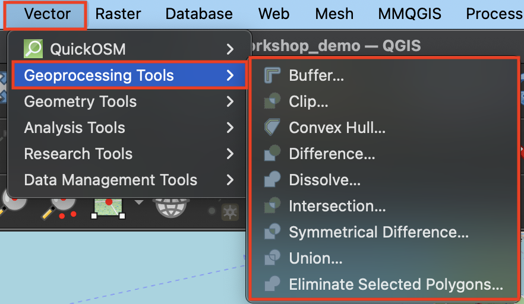 -->

>### Geometry
>{: .no_toc}
>Geometry tools are useful for operations to do with the geometric shape of the feature layer. The Geometry tool we will introduce today is: **Centroids**.

>### Analysis
>{: .no_toc}
>Analysis tools are useful for performing basic statistical analysis on vector layers. The Analysis tool we will introduce today is: **Count points in polygon**.

>### Research
>{: .no_toc}
>Research tools support further exploration of your data by running selections and generating random points for test scenarios. The Research tools we will introduce today are: **Select by Location** and **Select within Distance**. 

>### Data Management
>{: .no_toc}
>Data Management tools is useful for modifying the data layer itself. The Data Management tools we will introduce today are: **Merge Vector Layers**, **Join Attributes by Location**, and **Reproject Layer**. 

  

    Page Contents
  

  {: .text-delta }
 - TOC
{:toc}

----

# Open the Processing Toolbox
{: .no_toc}

For today, we'll search for tools from the **Processing Toolbox**. Go ahead and open the Processing toolbox now. 
> - If you don't see the Processing menu at the top of your screen, you may have to enable the processing plugin. Click on the **Plugins** menu at the top of your screen, and then on **Manage and Install Plugins…**. In the search bar, type in "Processing". Make sure to **select the Processing box**, and then click Close. You should now see the Toolbox icon and be able to proceed with the next steps. Once enabled, you will be able to access the Processing menu anytime you open this or any other QGIS project. 

 

> Make sure your map canvas is zoomed to Vancouver.

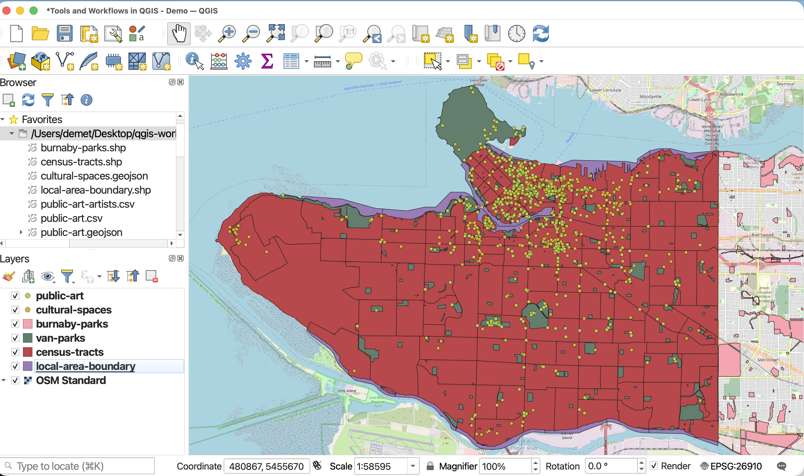

 

## Clip
The first tool we'll use is **[Clip](https://docs.qgis.org/3.44/en/docs/user_manual/processing_algs/qgis/vectoroverlay.html#clip){:target="_blank"}**, one of the most frequently used tools. Like a cookie cutter, Clip takes an Input layer (the cookie *dough*) and an Overlay layer (the cookie *cutter*), clipping the Input layer to the extent of the Overlay layer. Clip helps identify a set of points from a larger dataset within a particular area. It is a useful tool for highlighting a particular area of your map, honing your extent to certain area of interest. 

To Do
{: .label .label-green }

As it stands, `local-area-boundaries`, the layer visualizing Vancouver's neighborhoods juts out past the shoreline. 

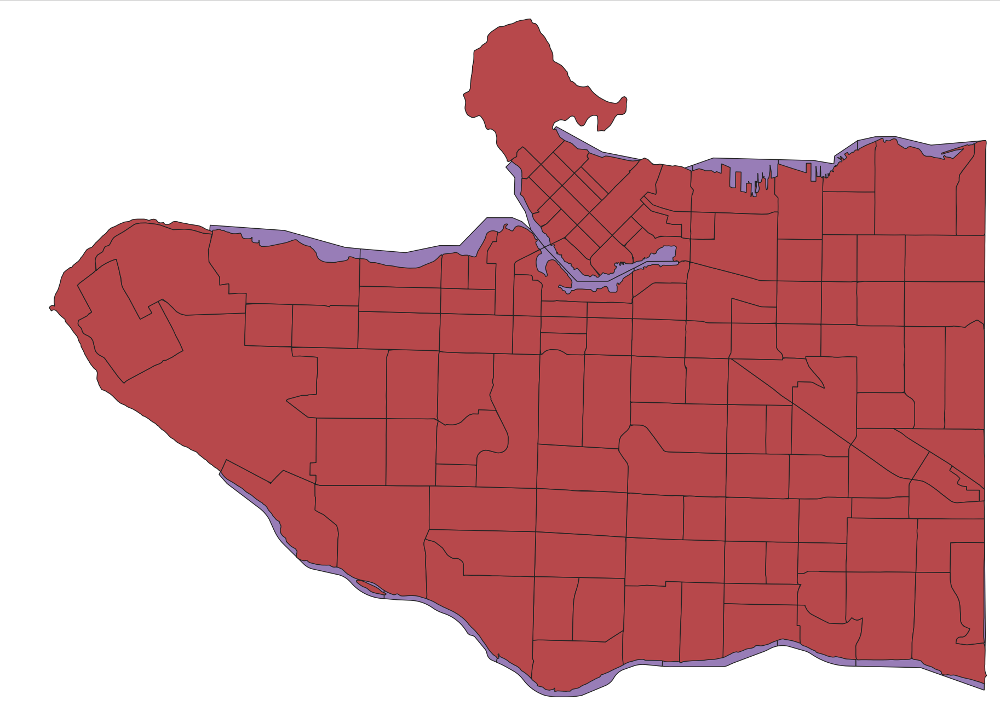
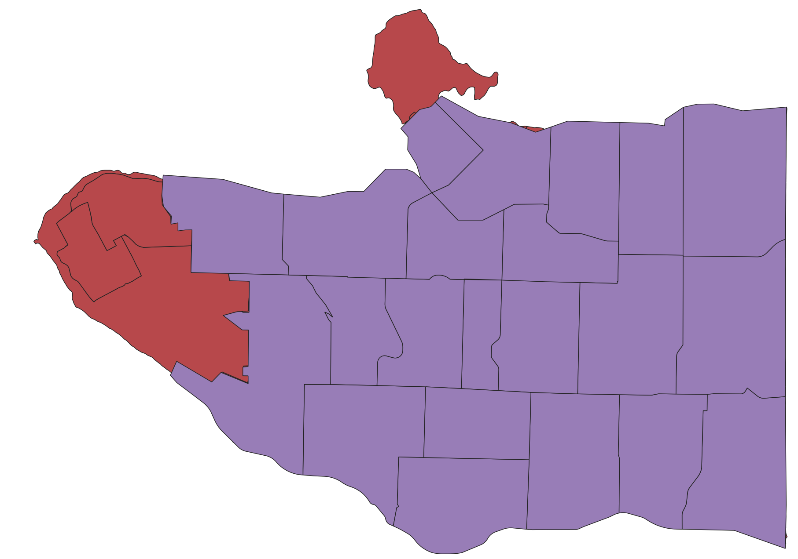

The `census-tracts` layer on the other hand nicely hugs the shore. Let's practice the **clip** tool by clipping `local-area-boundaries` to `census-tracts`. That way we can have a layer visualizing Vancouver neighborhoods where the shoreline is still visible. 

> In the Processing Panel, search for "Clip". Make sure you open the tool under **Vector Overlay**.

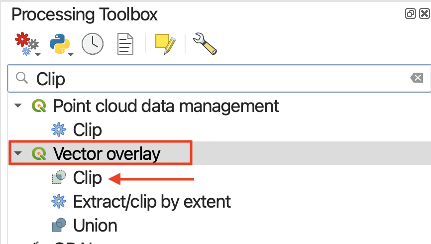

Clicking a tool will open a dialogue window specific to that tool. On the right hand side will be a description of what the tool does, and on the left, prompts for selecting input layers as well as saving the output layer to a file. 

> * Set `local-area-boundaries` as your Input layer
> * Set `census-tracts` as your Overlay layer 

The choice to save the output layer as a **permanent** or **temporary** file depends on whether you are running an intermediary step in your workflow. Temporary files will be deleted when you quit your QGIS project, whereas permanent files are new datasets you saved and stored on your computer. Temporary layers load with the layer name of the tool — in this case, "Clip".

Since we're just practicing, we could leave the output as a temporary layer. However, since this will be a useful layer to have, let's save it as a permanent file before running by clicking "Save to file". Remember to give it a location (by clicking the tree dots `...`) as well as a name, such as `local-areas-clip` or `neighborhoods`. Save the output as a shapefile. 

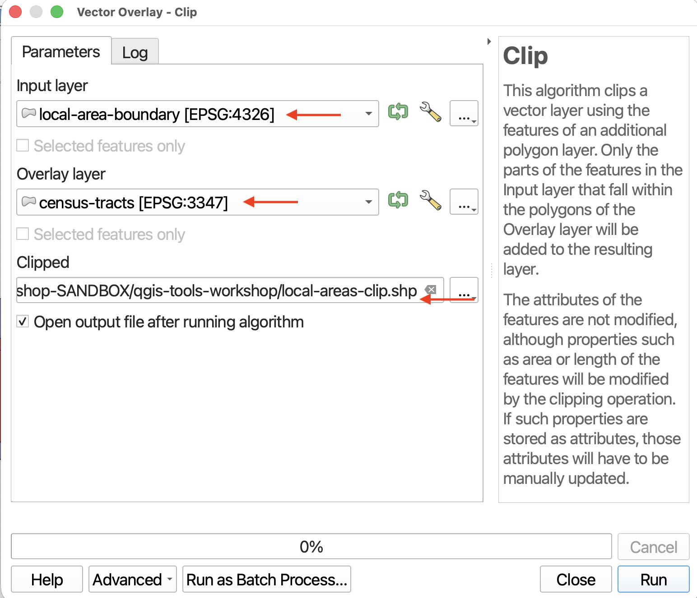

> * The tool window might disappear after setting the output filepath. Find the window again and click **Run**. Ignore any warning saying "No spatial index exists for the input layer"; this is how the data came from the City of Vancouver.  

> * Close the tool (it might have jumped behind your main QGIS interface), and return to your map view. Toggle off `public-art` and `cultural-centers` for a moment so you can see the new Clip layer alone. 

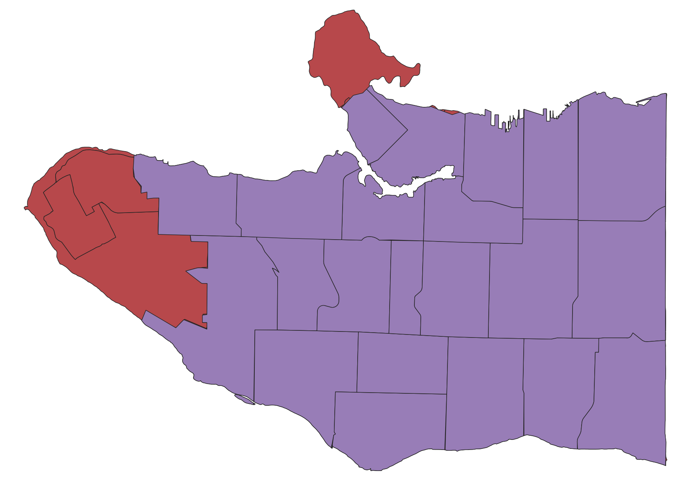

The attribute table will be the same. The only thing different is the outline of the layer. 

 

## Buffer
**[Buffer](https://docs.qgis.org/3.44/en/docs/gentle_gis_introduction/vector_spatial_analysis_buffers.html){:target="_blank"}** is probably the second most used/useful tool. Like the name implies, buffer creates a new layer that buffers a distance around points, lines, or polygons, and includes the area of the feature(s) buffered. Buffer is therefore useful for determining spatial proximity but defining a distance zone around features. For example, you could use Buffer areas prone to flooding around a water feature, or to determine a radio signal’s geographic influence or the area of a neighborhood disturbed by construction sounds.

To Do
{: .label .label-green }

Find the Buffer tool under **Vector Geometry**.

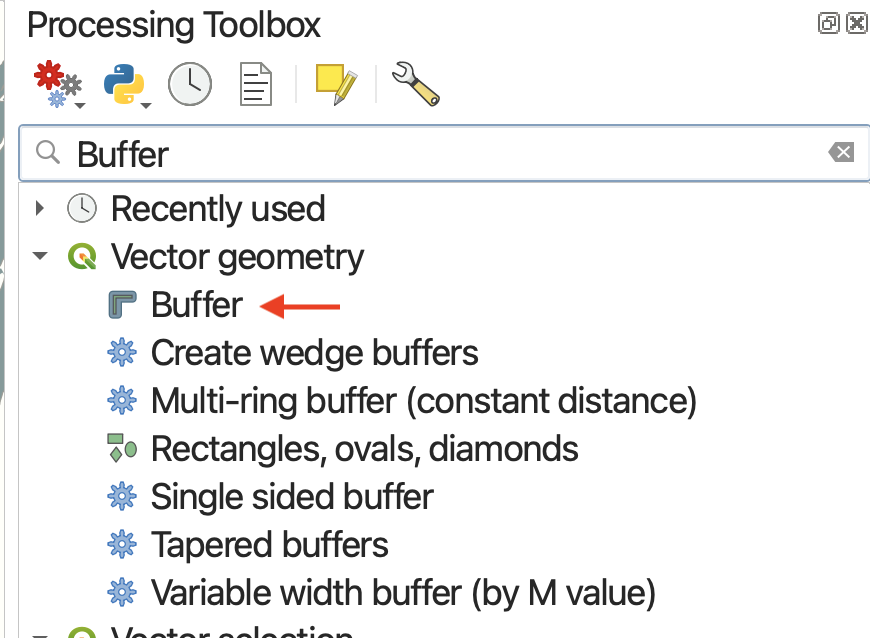

The Input Layer is the layer you want to buffer. If we were to try and buffer `cultural-spaces` — or `public-art` or `van-parks` for that matter — we would get an error. This is because the input layer must be in a projected coordinate system (PCS) in order to buffer a distance around it. Currently, these layers are in `WGS 84`, a geographic coordinate system (GCS) only. If the layer is in a geographic coordinate system, you will see an error telling you QGIS cannot buffer distance in degrees.

 

We need to **Reproject** our `cultural-spaces` layer before we can buffer it. 

>* Search for the **Reproject Layer** tool.

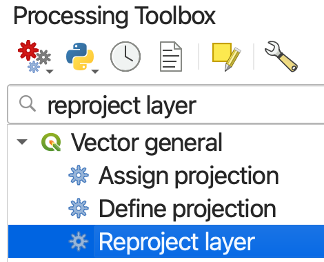

>* Reproject `cultural-spaces` to the following CRS: `NAD83 / UTM zone 10N` - the same as our Project CRS. 
<!-- **Save** the output as a permanent file called `cultural-spaces-reprojected`.  -->
>* **Run** and close the tool. You should now see a new temporary layer called `Reprojected`. It looks the same since our QGIS Project was reprojecting the prior layer on the fly to the same projection. However, we can now buffer this layer. It can help to rename this temporary layer in your Layers panel to something more meaningful such as `cultural-spaces-reprojected`. 

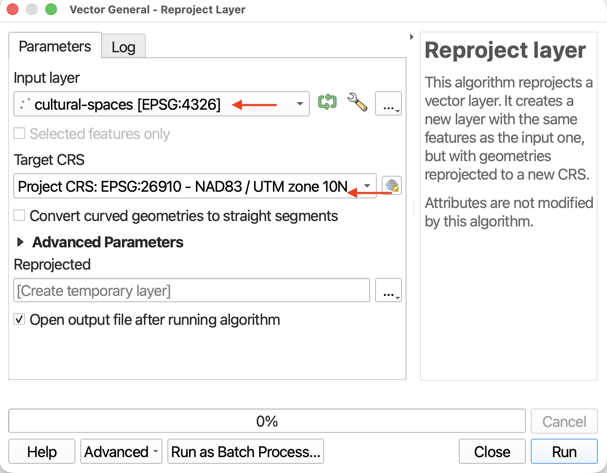

 

>* Now, Buffer `500 meters` around the reprojected cultural spaces layer, `Reprojected`. At first, just run the tool with only the input layer and buffer distance modified. The temporary output layer, `Buffer`, will look like the image below, with a buffer generated for each point feature. 

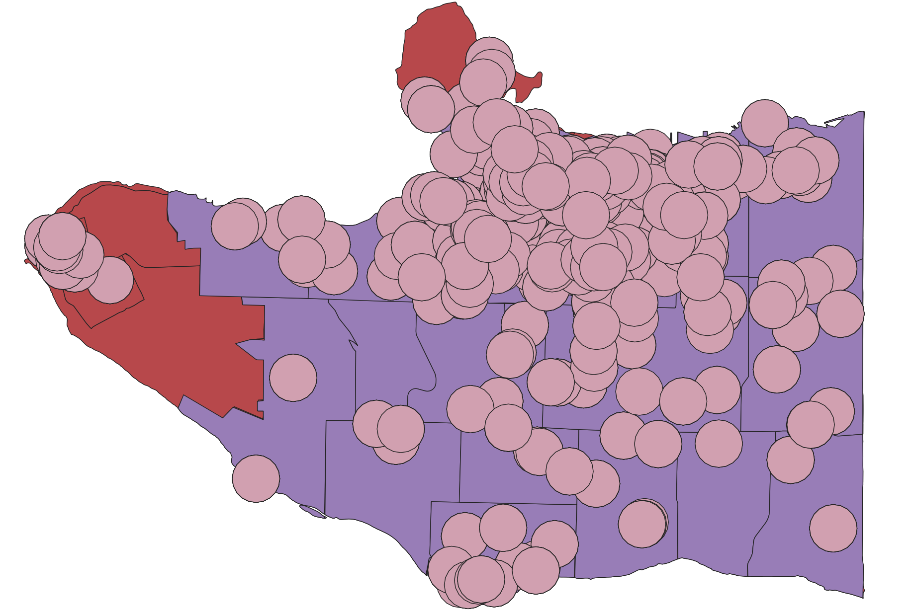

 

If we were only interested in the general area within 500 meters of a cultural center, we could scroll down and check the **Dissolve result** option before running the Buffer tool. The **Dissolve** option indicates whether or not you want the buffers of individual features to dissolve if they overlap. 

>* Run 500 meter buffers again on `Reprojected` cultural spaces, but this time check **Dissolve result**. The output will look like the image below. 

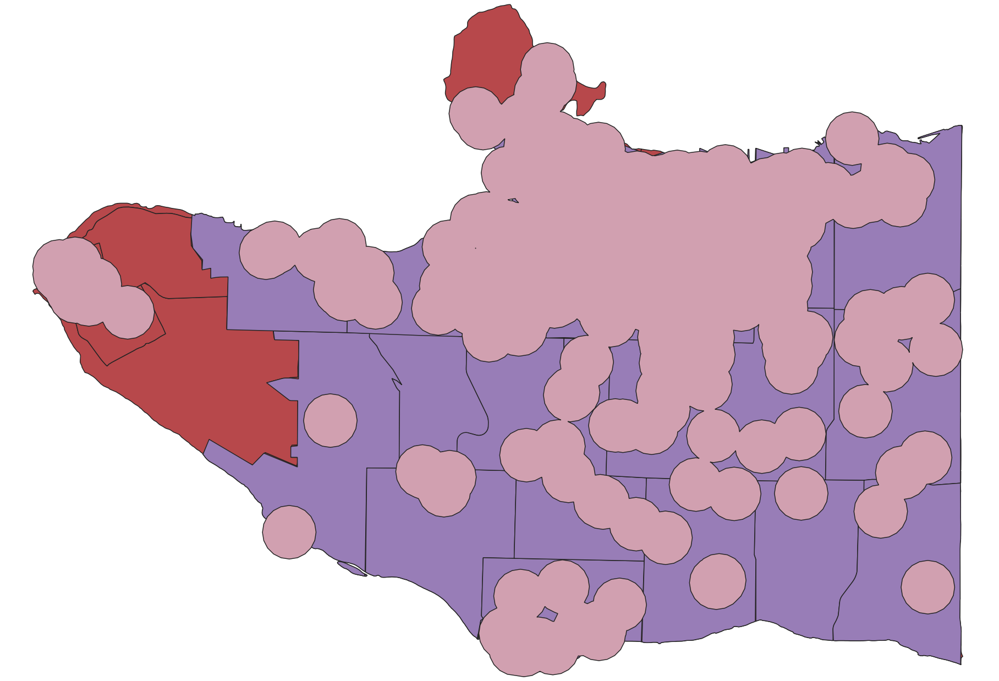

 

 SAVE your project. 

 

## Dissolve 
**[Dissolve](https://docs.qgis.org/3.44/en/docs/user_manual/processing_algs/qgis/vectorgeometry.html#dissolve){:target="_blank"}** takes multiple features within 1 layer and dissolves the boundaries between them. This is exactly what happened when we checked the Dissolve option on in the Buffer tool. 

As it stands, the shapefile for `census-tracts` has numerous features. When symbolizing the layer for our reference map earlier, we were unable to get rid of these lines. Perhaps you don't want these lines visible. Dissolve will remove the differentiation; *however, as an important caveat, the resulting layer will no longer have distinct features in the attribute table*. 

To Do
{: .label .label-green }

Open the **Dissolve** tool under **Vector geometry**

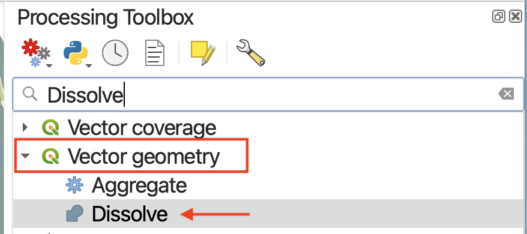

> * Dissolve `census-tracts`. 

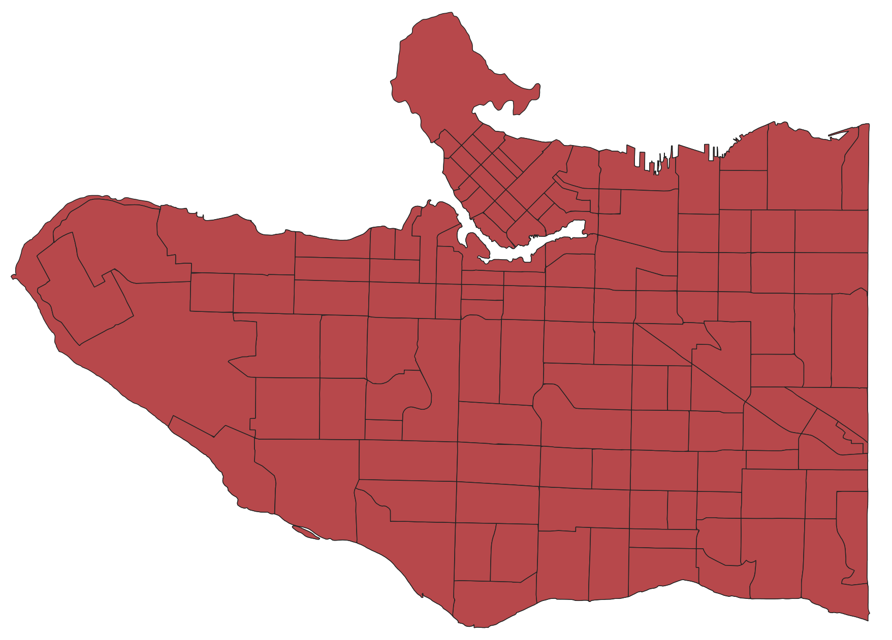
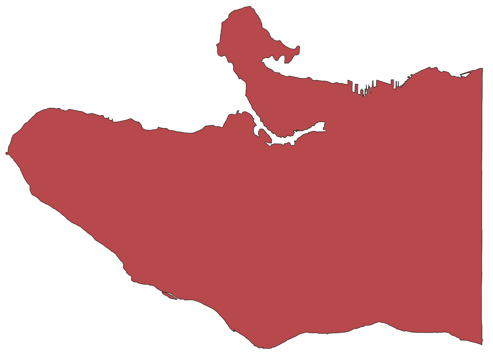

 

## Difference
**[Difference](https://docs.qgis.org/3.44/en/docs/user_manual/processing_algs/qgis/vectoroverlay.html#difference){:target="_blank"}** is like a spatial subtraction. Again, it will create a new layer so you don't have to worry about permanently altering your existing data (the correlate tool in ArcGIS, Erase, does just that). 

To Do
{: .label .label-green }

>* Just to practice, run the **Difference** tool to find areas that are within 500 meters of a cultural center, but are **not** parks. Your Input Layer will be `Buffered` and your Overlay Layer will be `van-parks`. It may help to rename the Buffered layer which was dissolved prior to running this tool. 

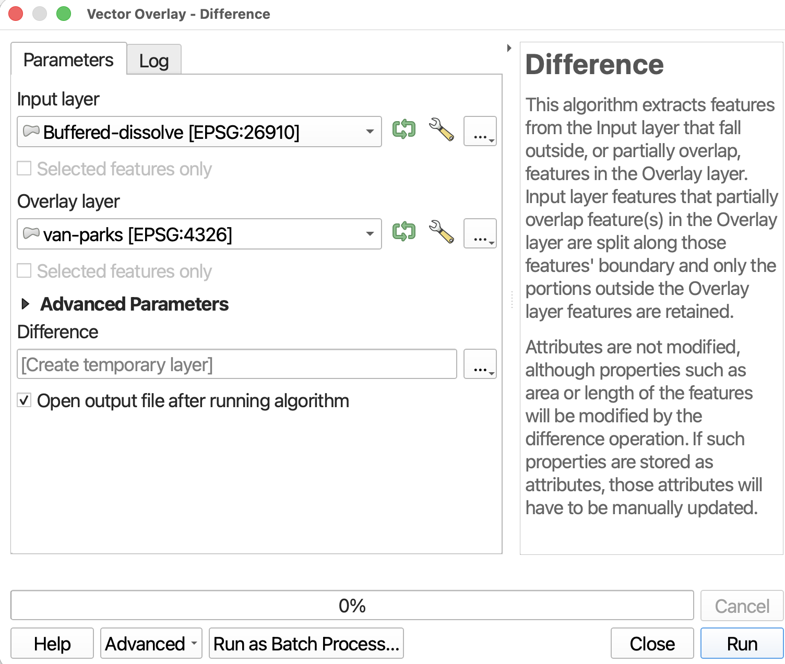

> Drag the output `Difference` to the top of your Layers panel, and uncheck extraneous layers. 

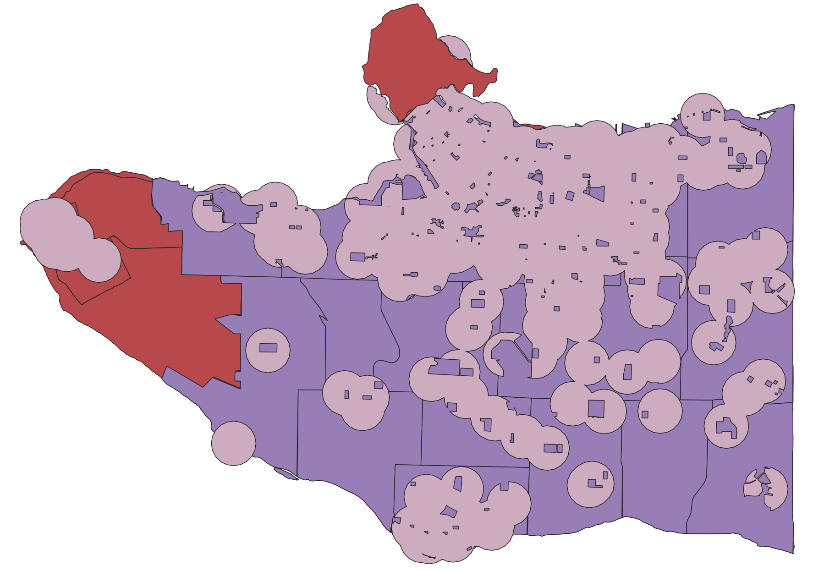

 

## Merge
Writes QGIS: **[Merge](https://docs.qgis.org/3.44/en/docs/user_manual/processing_algs/qgis/vectorgeneral.html#merge-vector-layers){:target="_blank"}** "Combines multiple vector layers of the same geometry type into a single one." 

Merge can be a useful tool to manage your data. For example, we currently have 2 layers for parks: `van-parks` and `burnaby-parks`. To make life easier, we could just merge them all together into one layer. Because we are essentially combining datasets, the attribute table of the resulting layer would include the complete information for all parks. 

To Do
{: .label .label-green }

> * Open the **Merge Vector Layers** tool under **Vector general**.

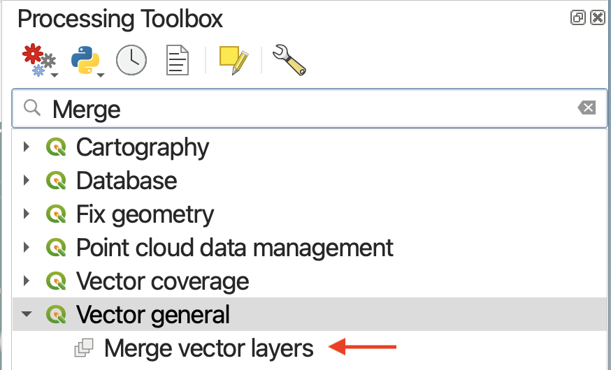

> * Click the three dots to choose your Input Layers. Select `van-parks` and `burnaby-parks`, then click the `<` arrow icon to return to the tool parameters. 

> * Set the Destination CRS to be that of the project. This only matters if your Input layers have different CRSs.

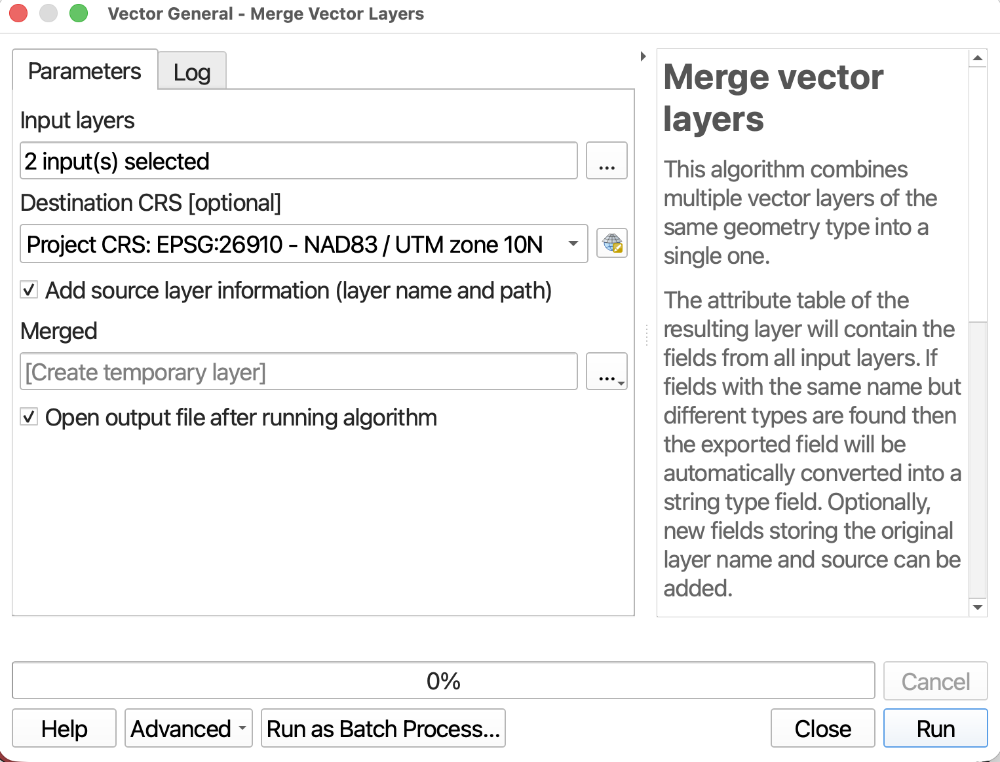

 

>* **Run** the tool and close it. Return to your Map Canvas and zoom-to the new `Merged` layer. Open the attribute table as well to confirm the success of your merge. 

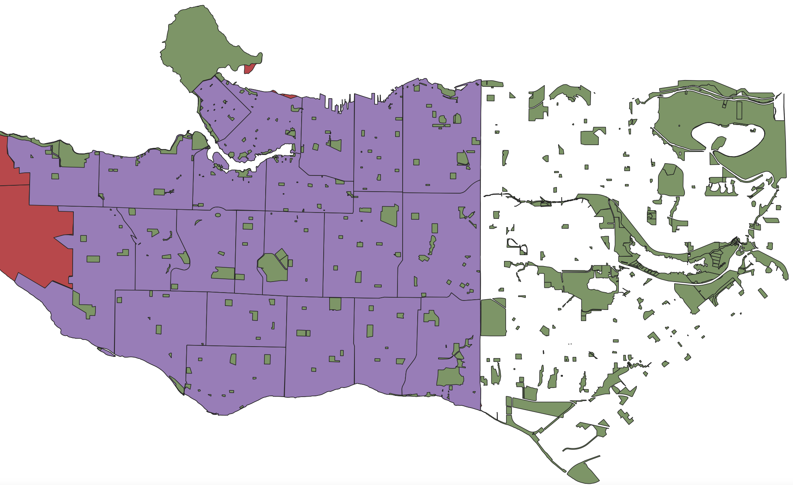

 

## Count points in polygon
This tool will count the number of points in each polygon and append the total to each feature of the input polygon as a new attribute.

>* Count how many `public-art` features are in each Vancouver neighborhood. *Which neighborhood has the most public art?*

 

## Centroids
- **Centroids** will calculate the geometric center of each feature and output a layer consisting of those points. This is useful if you have a polygon layer and want to turn it into a point layer. 

>* To practice, run **Centroids** on `local-areas-clip`.

 

## Select by location
**[Select by location](https://docs.qgis.org/3.44/en/docs/user_manual/processing_algs/qgis/vectorselection.html#select-by-location){:target="_blank"}** allows you to select features in 1 layer based on their spatial relationship with those in another layer using various spatial operators. 

 

>* Use **Select by Location** to find all parks from your `Merged` layer that are *within* Vancouver. This should successfully highlight just those parks that are within the city limits again. 

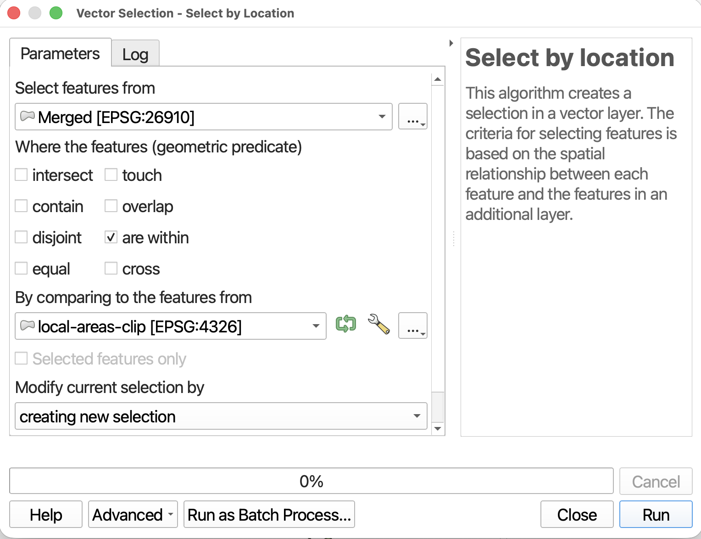
 
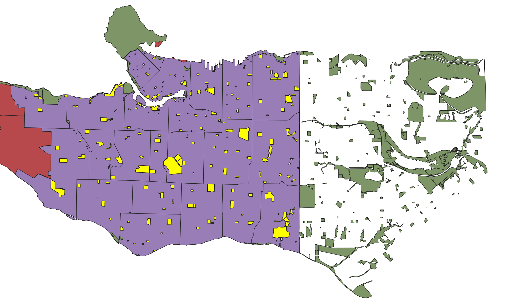

<!--note about building on selections-->

Cancel your selection from the Selections Toolbar. 

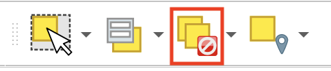

Note that you can also locate both the **Select by Location** and the **Select within Distance** tools from the Selections toolbar. 

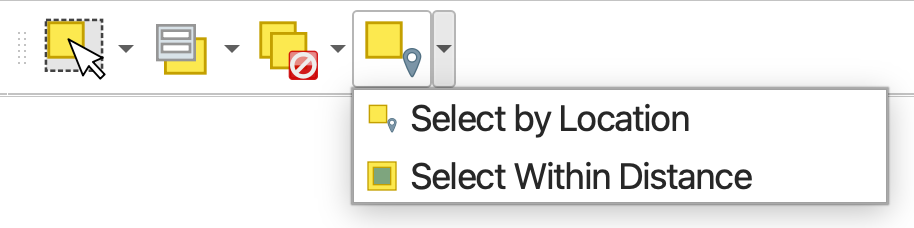

 

## Select within Distance
Slightly different than the above tool, **[Select within distance](https://docs.qgis.org/3.44/en/docs/user_manual/processing_algs/qgis/vectorselection.html#select-within-distance){:target="_blank"}** "creates a selection in a vector layer. Features are selected wherever they are within the specified maximum distance from the features in an additional reference layer" (QGIS). 

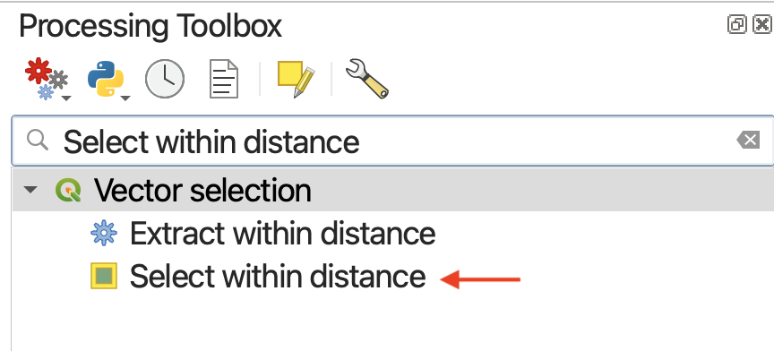

> * Let's practice by selecting all `public-art` within `100 meters` of Cultural Space. Remember to use your reprojected version of `cultural-spaces` as your . You may need to run **Reproject layer** on `public-art` to assign it the project CRS, `NAD83 / UTM zone 10N`, as well before you can run this tool. 

 

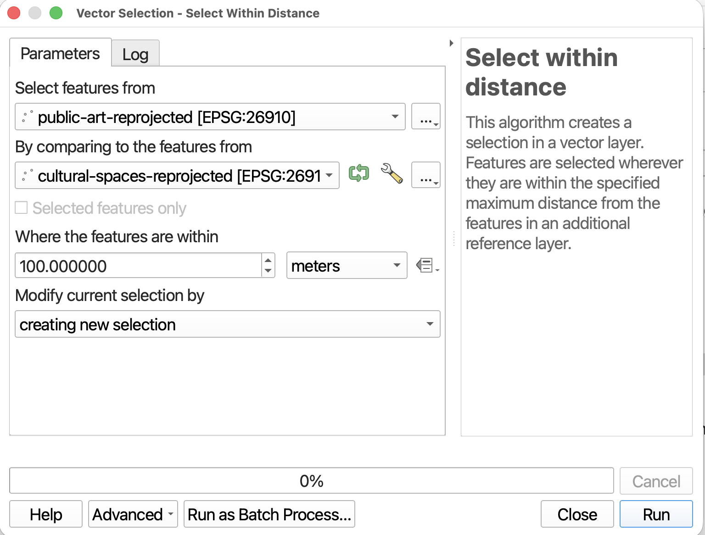

 

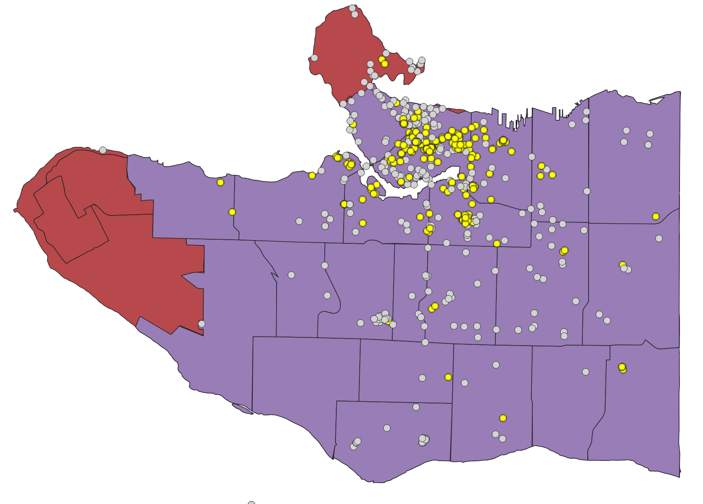

  

# Designing Workflows
Now it's time to put everything you learned together by designing workflows to answer spatial questions. Using the tools above, think through how you might solve for the following... 

<!-- *1*{: .circle .circle-purple} How would you determine Instead of using the tool "Select within distance", how could you use clip and buffer to find out the number of bus stops within 50 meters of a historic public bath?

*2*{: .circle .circle-purple}
 -->

*1*{: .circle .circle-purple} Create a layer that visualizes areas of Vancouver that are NOT within 300 meters of either a cultural center or public art feature. 

*2*{: .circle .circle-purple} Which Vancouver neighborhood has the fewest total parks?

*3*{: .circle .circle-purple} Which census tracts have a cultural center? 

<!-- centroids of parks, count points in polygons (parks) then check attribute table -->

<!-- ---
#### Resources for further exploration 
- [QGIS Beginner Guide](https://docs.qgis.org/3.44/en/docs/training_manual/vector_analysis/basic_analysis.html)
- [Working with Vector Data in QGIS](https://docs.qgis.org/3.34/en/docs/user_manual/working_with_vector/index.html)
- [Vector Overlay Tools](https://docs.qgis.org/3.34/en/docs/user_manual/processing_algs/qgis/vectoroverlay.html#clip) -->
