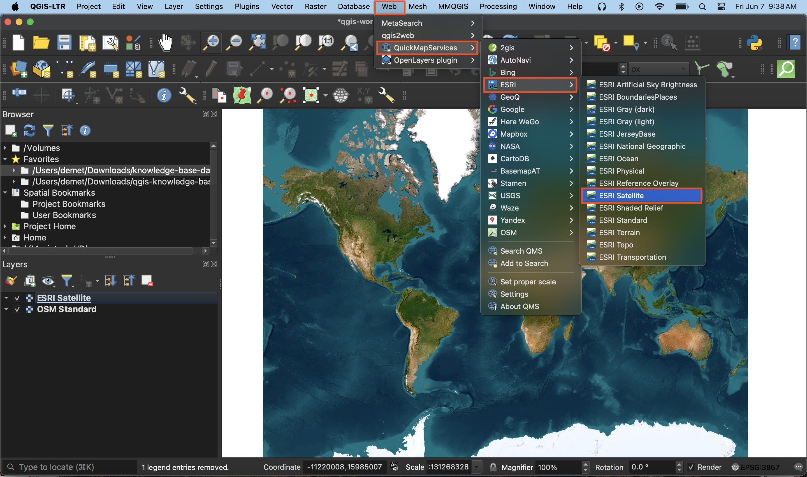

# Add a Basemap      

A basemap is helpful to give spatial context to your data as you work. One way to add a basemap is through a plugin. [QGIS plugins](https://plugins.qgis.org/) are user developed tools that extend QGIS functionality beyond the basics. 

Two popular plugins for accessing basemaps are **QuickMapServices** and **OpenLayers**. Installing either of these plugins will connect you to a host of different basemaps which you can browse and add to your project all within your QGIS interface. 

*1*{: .circle .circle-purple}
To access basemaps, we'll first install the QuickMapServices plugin. Click on the **Plugin** menu at the top of your screen and select **Manage and Install Plugins...**   

 
   
    
*2*{: .circle .circle-purple} In the dialogue box that opens, select **All** as a search category on the left and type "QuickMapServices" as one word. Install the plugin and close the dialogue box.    

    

 
  
*3*{: .circle .circle-purple} 
Now go to the **Web** menu at the top of your screen. You should see the QuickMapServices plugin. Hover over it and click "Settings" at the bottom of the menu that pops up. In the settings dialogue box go to the "More services" tab and click "Get contributed pack." Click **save** to close settings and return to the **Web** menu. This time when you hover over the QuickMapServices plugin you will see an array of basemap options. 
    
 
  
*4*{: .circle .circle-purple} 
Try adding different basemaps such Esri Sattelite or OSM Standard. Like QGIS, [Open Street Map (OSM)](https://www.openstreetmap.org/about) is open source and user developed. 

    

 
  
Use the zoom tools (magnifying glass icons) located in the toolbar to zoom to see each basemap in detail. Hide a basemap at any time by unchecking the box beside it in the Layers panel. Remove a basemap at anytime by right clicking the layer and selecting "remove."
    

 

---
#### Resources for further exploration

- Explore other [popular QGIS Plugins](https://plugins.qgis.org/plugins/popular/) or browse plugins through [keyword tags](https://plugins.qgis.org/plugins/) through keyword tags

- Many basemaps that are hosted by web services are tile layers. This means they are a collection of static images ([map tiles](https://ubc-library-rc.github.io/gis-intro-leaflet/content/leaflet-basemap.html)) that are loaded as you zoom in and out on your screen. Therefore, you can also connect a basemap as an XYZ tile connection. [This video](https://www.youtube.com/watch?v=ht7tgmuwkpA) will show you how. Youtube is an excellent place to go for QGIS demos because chances are, not only has someone had the patience to work through the question at hand, they have kindly made it available on the internet for other QGIS users like yourself to benefit from! 
 
- If you find web-based maps interesting, check out the Research Commons' [Leaflet Workshop](https://ubc-library-rc.github.io/gis-intro-leaflet/) or [Introduction to web mapping with Mapbox](https://ubc-library-rc.github.io/intro-mapbox/)

