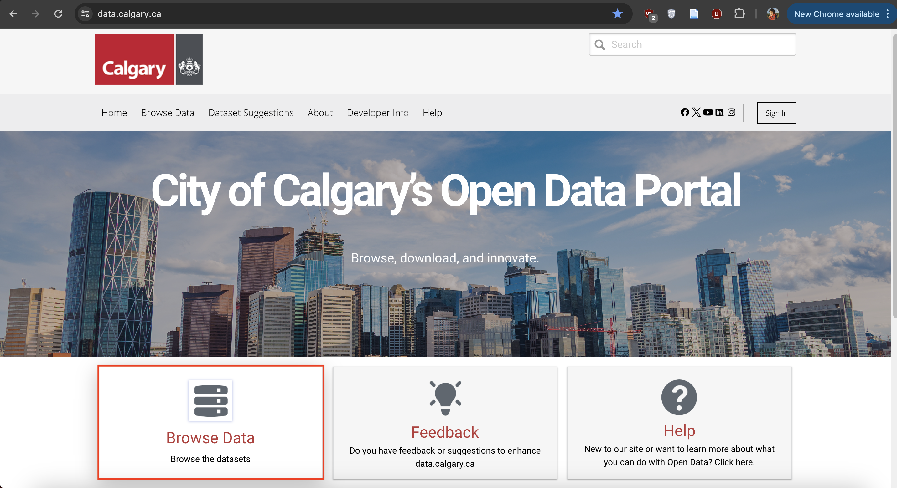
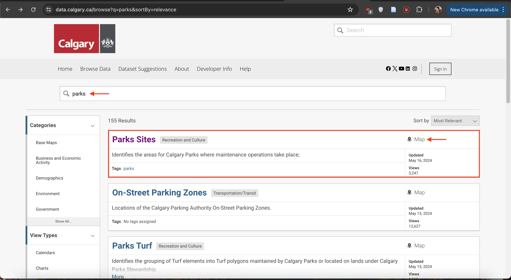
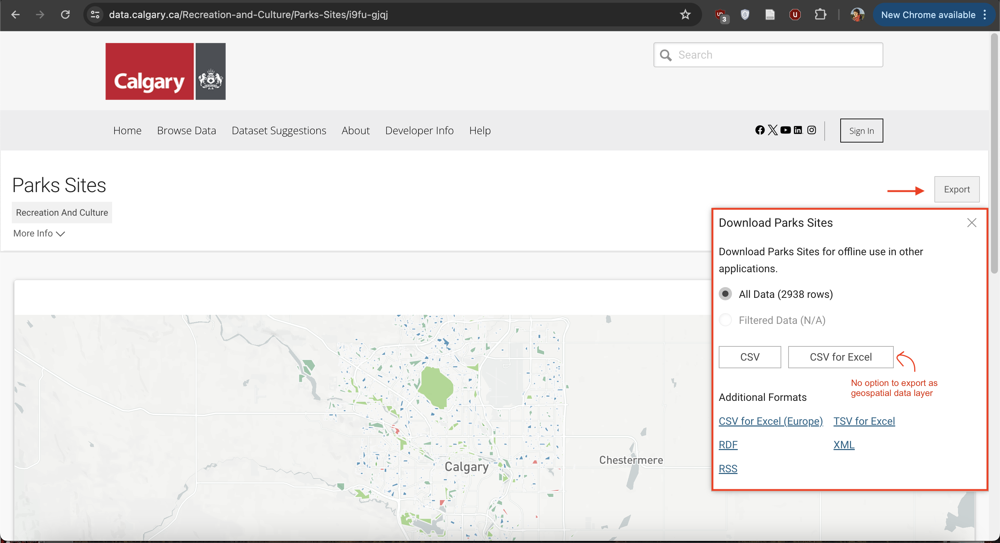
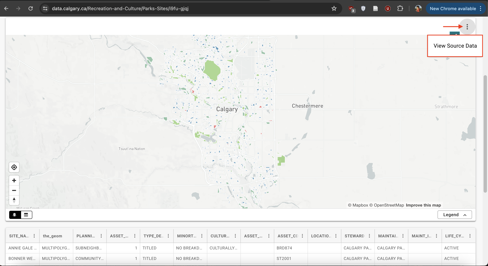
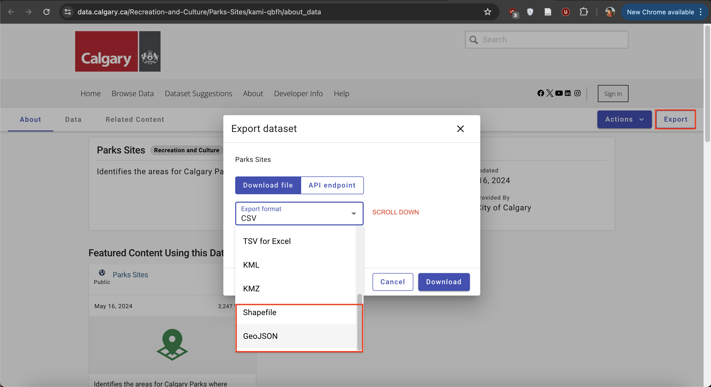
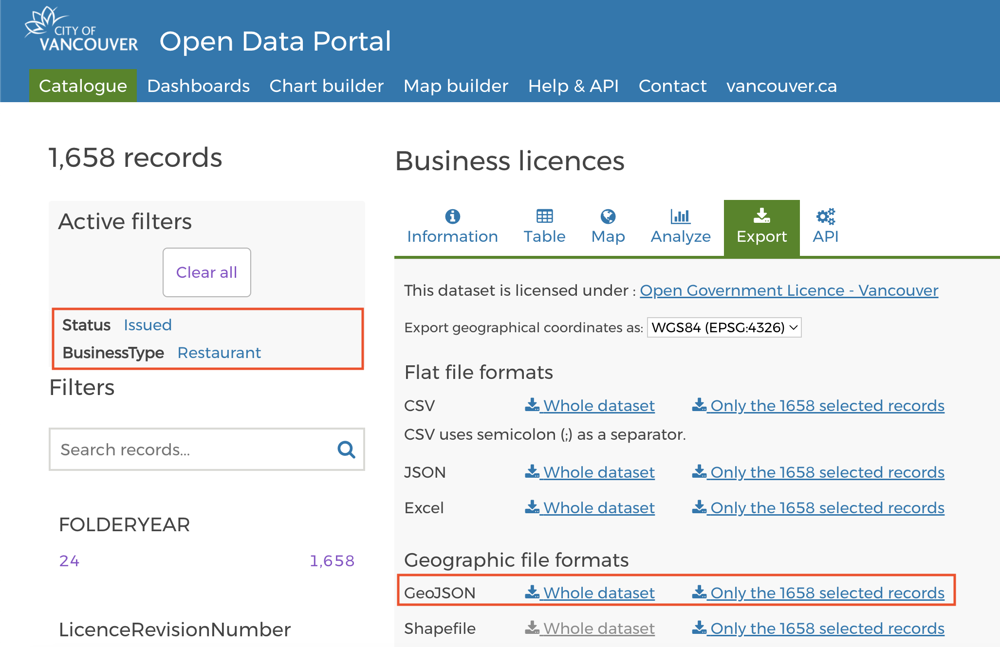
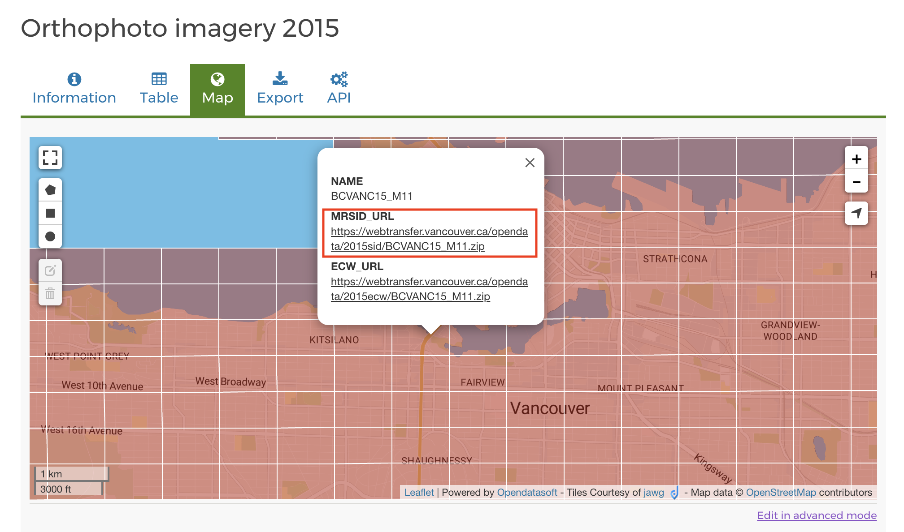

# Downloading Data

<!-- Note: Data in data folder; practice downloading from different sites. demo is on calgary but Vancouver dataset in data folder. Download data to qgis-workshop folder.  -->

### When there's a map, there's geospatial data
Downloading geospatial data from municipal data portals isn't always straightforward.It can be tricky to find the right buttons to press to downlaod the right file format. 

    

    

 

# Practice finding & downloading data

## #1 Download Public Parks
Practice finding data by downloading Vancouver's parks, and the geospatial dataset of parks from one other municipality. 

The dataset might not be named simply 'parks' but 'parks and open spaces'. Wherever possible, download in .geoJSON format rather than shapefile. This reduces the size of the file and also allows you to quickly visualize the data and explore its properties in something like [geojson.io](https://geojson.io/#map=2/0/20). Unzip the downloaded file if needed, and move its contents to your workshop folder.

[Vancouver](https://opendata.vancouver.ca/pages/home/) 
[Victoria](https://opendata.victoria.ca/)  
[Toronto](https://open.toronto.ca/) 
[Kelowna](https://opendata.kelowna.ca/) 
[Kamloops](https://mydata-kamloops.opendata.arcgis.com/) 
[Calgary](https://data.calgary.ca/)  

<!-- [Guelph](http://data.open.guelph.ca/) Note - when you go to resource - raw geojson. copy contents. go to [geojson.io](https://geojson.io/#map=2/0/20). delete contents on left hand column. paste your data in. save.   -->

## #2 Download Business Licenses 

Use the filter function on the lefthand panel to download only **Restaurants** with **Issued** licenses from all Vancouver [business licenses](https://opendata.vancouver.ca/explore/dataset/business-licences/map/?disjunctive.status&disjunctive.businesssubtype&sort=businesstype&dataChart=eyJxdWVyaWVzIjpbeyJjaGFydHMiOlt7InR5cGUiOiJsaW5lIiwiZnVuYyI6IkNPVU5UIiwieUF4aXMiOiJmZWVwYWlkIiwic2NpZW50aWZpY0Rpc3BsYXkiOnRydWUsImNvbG9yIjoiIzAyNzlCMSJ9XSwieEF4aXMiOiJmb2xkZXJ5ZWFyIiwibWF4cG9pbnRzIjoiIiwidGltZXNjYWxlIjoiIiwic29ydCI6IiIsImNvbmZpZyI6eyJkYXRhc2V0IjoiYnVzaW5lc3MtbGljZW5jZXMiLCJvcHRpb25zIjp7ImRpc2p1bmN0aXZlLnN0YXR1cyI6dHJ1ZSwiZGlzanVuY3RpdmUuYnVzaW5lc3NzdWJ0eXBlIjp0cnVlLCJzb3J0IjoiYnVzaW5lc3N0eXBlIiwicmVmaW5lLmJ1c2luZXNzdHlwZSI6IlJlc3RhdXJhbnQiLCJyZWZpbmUuc3RhdHVzIjoiSXNzdWVkIn19fV0sImRpc3BsYXlMZWdlbmQiOnRydWUsImFsaWduTW9udGgiOnRydWUsInRpbWVzY2FsZSI6IiJ9&location=12,49.24813,-123.12161). Move the downloaded file to your workshop folder. 

## #3 Download Aerial Imagery
Use the [interactivemap](https://opendata.vancouver.ca/explore/dataset/orthophoto-imagery-2015/map/?location=11,49.26624,-123.11794) to download the aerial imagery for 1 grid tile of Vancouver. To do so, click the tile and download the zip folder under the field `MRSID_URL`. Unzip the downloaded file and move it's contents to your workshop folder. 

Before moving on, make sure all downloaded files are unzipped and moved to your workshop data folder.
{: .note}