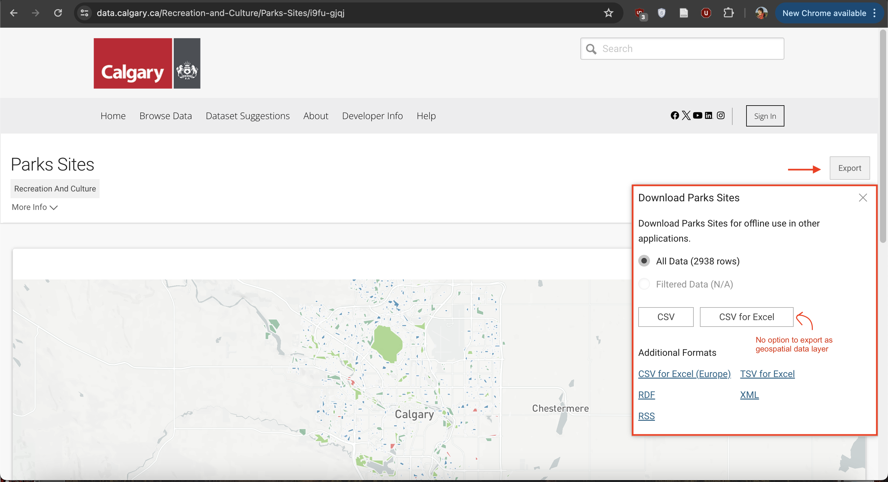
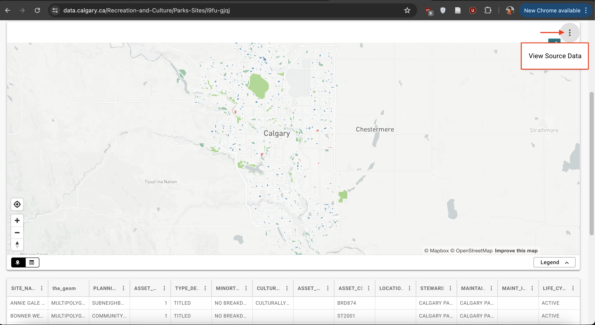

# Finding Data

## Types of Geospatial Data
Geospatial data is often referred to as having two main types: raster and vector. These two data types, while both geospatial, are very different from one another. Raster data is data which is made up of pixels arranged in a grid, whereas vector data is made up of vertices and the paths between them – creating geometries that represent real-world features or phenomena. In other words, a vector data layer will be made up of either points, lines, or polygons. A third type of spatial data is tabular data. Tabular data are data formatted into a table by rows and columns. If the tabular dataset has columns referring to geometry such as latitude and longitude, then the dataset can be displayed in the virtual geographic space of a GIS. 

## Where to look
Municipal and federal data repositories are a good place to begin. If you have access to a data repository, either through a group you’re working with/for or institutional library for example, reaching out to whoever coordinates on the matter can be useful. You can also begin with a web search and see what is returned. Lastly - making your own. 

## Considerations 
Whether you’re performing spatial analysis or making maps for yourself or a client, its important to keep a record of your data sources as you work. You’ll figure out a system that make sense to you. Trial and error a few times. However, The following considerations are useful to note somewhere like a document or notes file as you go.

```
- What is the dataset of and where did you download it from (save a link)
- What is the downloaded file called? Where is it stored on your computer/external storage device?
- Is there a visual data preview such as an interactive web map?
- What attributes are included in the dataset? 
- Who is the dataset published by and is there a contact for questions? 
- What is the dataset's license?
- When was it last updated?
- What formats can the dataset be downloaded in? 
- What projections can the dataset be downloaded in?
```


# Downloading Data

Note: Data in data folder; practice downloading from different sites. demo is on calgary but Vancouver dataset in data folder. Download data to qgis-workshop folder. 

### When there's a map, there's geospatial data
Downloading geospatial data from municipal data portals isn't always straightforward.It can be tricky to find the right buttons to press to downlaod the right file format. 


    



    


## To do #1
Practice finding data by downloading a geospatial dataset  of parks from one (or more) of the following municipal open data portals. Geojson (possible for all), WGS84 if option. Polygon. Might not be named simply 'parks' but parks and open spaces etc. 

<br>

[Victoria](https://opendata.victoria.ca/) <br>
[Guelph](http://data.open.guelph.ca/) Note - when you go to resource - raw geojson. copy contents. go to [geojson dot io](https://geojson.io/#map=2/0/20). delete contents on left hand column. paste your data in. save. <br>
[Vancouver](https://opendata.vancouver.ca/pages/home/)<br>
[Toronto](https://open.toronto.ca/)<br>
[Kelowna](https://opendata.kelowna.ca/)<br>
[Kamloops](https://mydata-kamloops.opendata.arcgis.com/)<br>
[Calgary](https://data.calgary.ca/) <br>


## To do #2

Use the Filter function to download only Restaurants with Issued licenses from all [business licenses](https://opendata.vancouver.ca/explore/dataset/business-licences/export/?disjunctive.status&disjunctive.businesssubtype&sort=businesstype&dataChart=eyJxdWVyaWVzIjpbeyJjaGFydHMiOlt7InR5cGUiOiJsaW5lIiwiZnVuYyI6IkNPVU5UIiwieUF4aXMiOiJmZWVwYWlkIiwic2NpZW50aWZpY0Rpc3BsYXkiOnRydWUsImNvbG9yIjoiIzAyNzlCMSJ9XSwieEF4aXMiOiJmb2xkZXJ5ZWFyIiwibWF4cG9pbnRzIjoiIiwidGltZXNjYWxlIjoiIiwic29ydCI6IiIsImNvbmZpZyI6eyJkYXRhc2V0IjoiYnVzaW5lc3MtbGljZW5jZXMiLCJvcHRpb25zIjp7ImRpc2p1bmN0aXZlLnN0YXR1cyI6dHJ1ZSwiZGlzanVuY3RpdmUuYnVzaW5lc3NzdWJ0eXBlIjp0cnVlLCJzb3J0IjoiYnVzaW5lc3N0eXBlIiwicmVmaW5lLmJ1c2luZXNzdHlwZSI6IlJlc3RhdXJhbnQiLCJyZWZpbmUuc3RhdHVzIjoiSXNzdWVkIn19fV0sImRpc3BsYXlMZWdlbmQiOnRydWUsImFsaWduTW9udGgiOnRydWUsInRpbWVzY2FsZSI6IiJ9&location=12,49.24813,-123.12161)


## To do #3 
Use the interactive map to download the aerial imagery for one grid tile. Click the tile and download the zip folder under the field
[MRSID_URL](https://opendata.vancouver.ca/explore/dataset/orthophoto-imagery-2015/map/?location=13,49.25991,-123.19064). 


---
#### Resources
[types of geospatial data](https://www.geographyrealm.com/geodatabases-explored-vector-and-raster-data/)