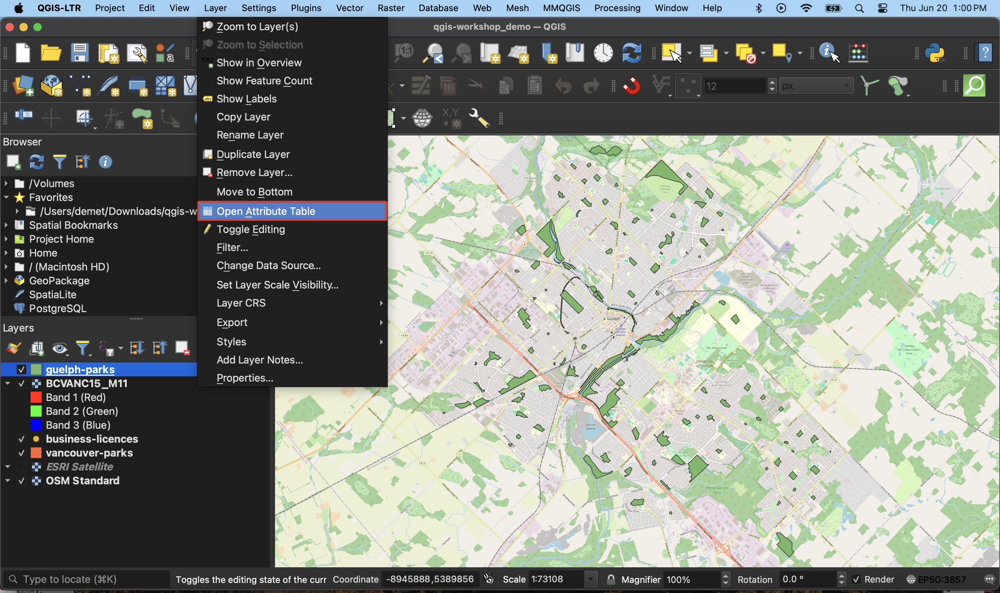
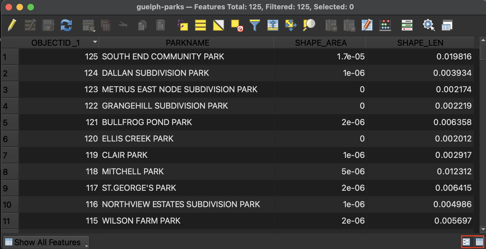
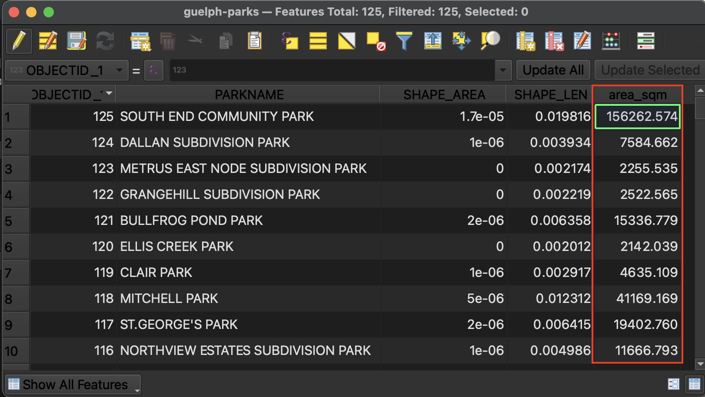
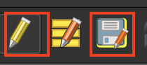

# Layer Attributes 
Control-click (right-click) your park of choice and open the <code><b>Attribute Table</b></code> in a new window. Here, you can see the tabular data associated with your parks. Note that there are several **attributes** (columns) that describe each **feature** (rows) in this dataset. Manually re-size the column widths until you can read each one. 

<!--  -->

At the top of the <code><b>Attribute Table</b></code> you will see the number of features (rows) loaded and the number selected. There are a total of 125 parks in the dataset downloaded for Guelph. 

You can sort columns by ascending/descending (both number values or alphabetically) by simply clicking the column headings.  

You can toggle between Form and Table view at the bottom-right corner. 

If right-justified means number; left-justified means text. 

## Field Calculator 
Toolbar 
Toggle editing mode

When editing mode is toggled on you will also see the little pencil in the layers panel

(check what measurement units are under project properties --> general)
Create new field and calculate area of each park.  
Toggle on editing mode 
The [Field Calculator](https://docs.qgis.org/3.34/en/docs/user_manual/working_with_vector/attribute_table.html#using-the-field-calculator) 
create new field --> field --> string to decimal etc
calculate area of vancouver parks 

save edits and toggle off editing mode 

## Select all parks where area is less than --
show all features/show selected features

## select one park and export 

---
#### Resources for further exploration
- The <code><b>Attribute Table</b></code> contains many useful clues for troubleshooting. Checking the attribute table as soon as you load a new layer will give you a sense if your data is in tact and what you might need to modify. 
- [QGIS Documentation for Working with the Attribute Table](https://docs.qgis.org/3.34/en/docs/user_manual/working_with_vector/attribute_table.html#index-0)