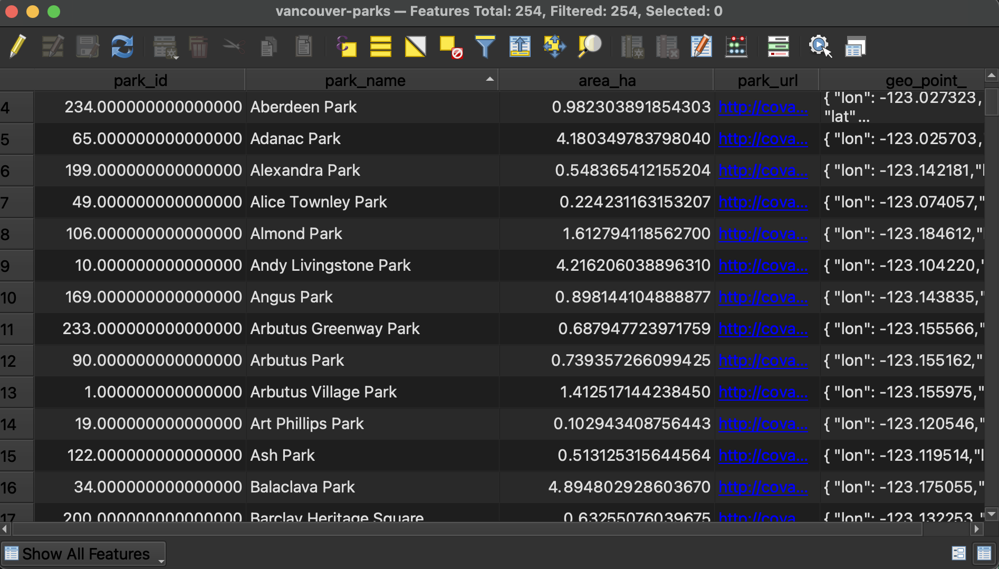
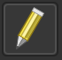
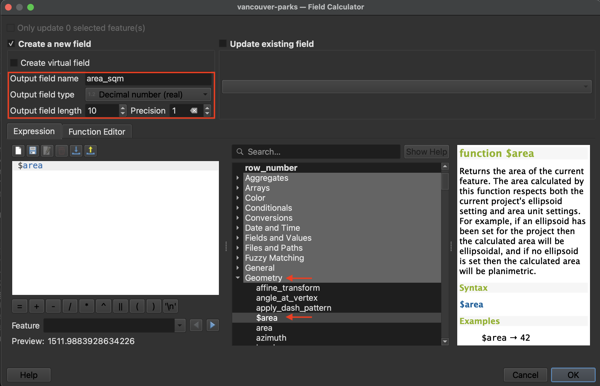
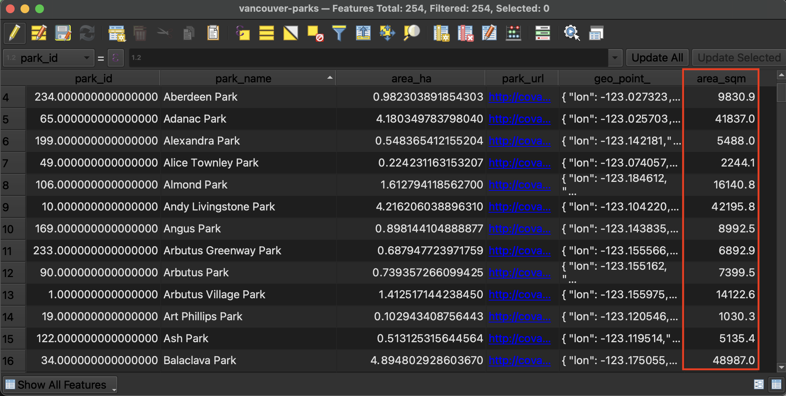
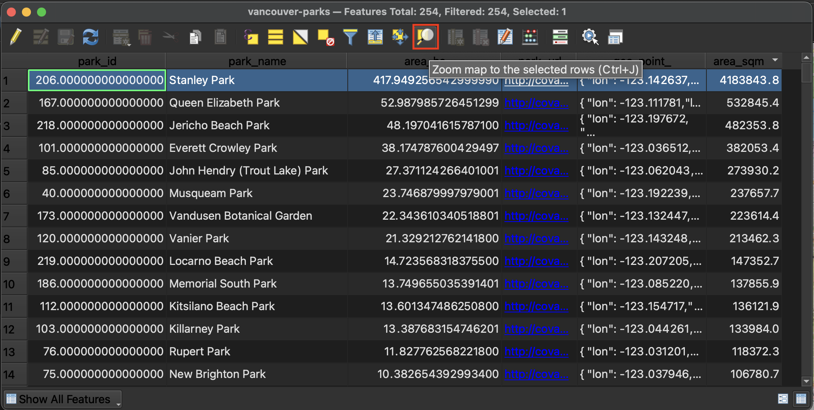
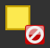

# Layer Attributes 

Right-click (control-click) the parks layer of your choice and open the **Attribute Table**. Here you can see the tabular data associated with your parks. Note that there are several **attributes** (columns) that describe each **feature** (rows) in this dataset. Manually re-size the column widths until you can read each attribute.
<!--describe what field is-->

<!--  -->

- At the top of the **Attribute Table** you will see the number of features loaded and the number selected. There are a total of 125 parks in the dataset downloaded for Guelph. 

- You can sort columns by ascending/descending (number value or alphabetically) by simply clicking the column headings.  

- You can toggle between **Form view** and **Table view** at the bottom-right corner of the window.

- If a column's contents are right right-justified, it means the values are stored as numbers; if a column's contents are left-justified, the values are formatted as text. This cue can come in handy when troubleshooting. If you ever find yourself attempting to symbolize your data based on an attribute value such as area but it isn't working, the issue may be that the attribute in question is stored as text rather than a numerical value. This can be fixed by editing the Attribute Table. 

## Use Field Calculator to calculate park areas

What if you wanted to have QGIS calculate the area of each park? This requires editing the attribute table to create a new column and then populate it with the geometry calculation.

*1*{: .circle .circle-purple} Toggle editing mode.  When editing mode is toggled on you will also see the little pencil in the layers panel. 

*2*{: .circle .circle-purple} Now open the [Field Calculator](https://docs.qgis.org/3.34/en/docs/user_manual/working_with_vector/attribute_table.html#using-the-field-calculator) from the Attribute Table's toolbar. 
    

*3*{: .circle .circle-purple} Create a new field called "area_sqm" and set the output field type to decimal number with 1 decimal point (precision 1). Expand the **Geometry** options in the middle panel and double-click `$area`. Hit **OK** at the bottom of the dialogue window to run the calculation.
    

        
*4*{: .circle .circle-purple} Return to the Attribute Table to see the results
    

*5*{: .circle .circle-purple} Save edits and toggle off editing mode. Save your QGIS project again.

<!-- ## Select all parks where area is less than --
Run a selection to select for all parks that --> 

## Select and export the largest park 

Order the parks by area in descending order. Select the park with the greatest area and zoom to it on your map canvas.

In your **Layers Panel**, right-click your parks layer and choose **Export** **-->** **Save Selected Features As...**. Save the selected park to your workshop folder with the name of the park as its filename. 

Clear your selection in the Attribute Table , close the Attribute Table, and return to the main QGIS interface. 

<!-- note- The <code><b>Attribute Table</b></code> contains many useful clues for troubleshooting. Checking the attribute table as soon as you load a new layer will give you a sense if your data is in tact and what you might need to modify.  -->

---
#### Resources for further exploration
- [QGIS Documentation for Working with the Attribute Table](https://docs.qgis.org/3.34/en/docs/user_manual/working_with_vector/attribute_table.html#index-0)
- [Introducing the Attribute Table Interface](https://docs.qgis.org/3.34/en/docs/user_manual/working_with_vector/attribute_table.html#introducing-the-attribute-table-interface)
- [Selecting features from the Attribute Table](https://docs.qgis.org/3.34/en/docs/user_manual/working_with_vector/attribute_table.html#selecting-features)
- [Editing Attribute Values](https://docs.qgis.org/3.34/en/docs/user_manual/working_with_vector/attribute_table.html#editing-attribute-values)