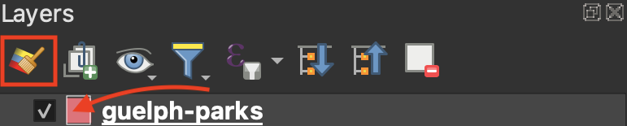

# Layer Properties

In your <code><b>Layers Panel</b></code>, zoom to your parks of choice. 
Control-click (right-click) the layer and open its <code><b>Properties</b></code>. While today's workshop won't explore Layer Properties in detail, it's important to know how to access the [Vector Properties Dialogue](https://docs.qgis.org/3.34/en/docs/user_manual/working_with_vector/vector_properties.html#). 

[**Information**](https://docs.qgis.org/3.34/en/docs/user_manual/working_with_vector/vector_properties.html#information-properties) and [**Source**](https://docs.qgis.org/3.34/en/docs/user_manual/working_with_vector/vector_properties.html#source-properties) will contain metadata for the layer, including the dataset's Coordinate Reference System (CRS). [**Joins**](https://docs.qgis.org/3.34/en/docs/user_manual/working_with_vector/vector_properties.html#joins-properties) is useful if, for example, you wanted to load a csv file to your QGIS project with additional data for parks but no geospatial coordinates.

## Labels
[**Labels**](https://docs.qgis.org/3.34/en/docs/user_manual/working_with_vector/vector_properties.html#labels-properties) will assign labels to your features based on an attribute value. 

To Do
{: .label .label-green }

Try adding the names of your parks to the map. 

    

## Symbology 
[Symbology](https://docs.qgis.org/3.34/en/docs/user_manual/working_with_vector/vector_properties.html#symbology-properties) is where you can change how your layer is symbolized and rendered. Currently, the symbology for parks is set to **Single Symbol** meaning every park is symbolized the same. 

To Do
{: .label .label-green }
Try changing the symbolization of all parks by clicking the color bar and choosing a different color from the dialogue box that opens. Click **Apply** in the lower left-hand corner of the <code><b>Layers Properties</b></code> dialogue window to see the color update on your Map Canvas. When you are content with your changes, click **OK**.

Note that you can also access a layer's symbology from the <code><b>Layers Panel</b></code>.

---
#### Resources for further exploration
- [Comprehensive descriptions for all Vector Layer Properties](https://docs.qgis.org/3.34/en/docs/user_manual/working_with_vector/vector_properties.html#)
- [Working with Vector Data in QGIS](https://docs.qgis.org/3.34/en/docs/user_manual/working_with_vector/index.html)