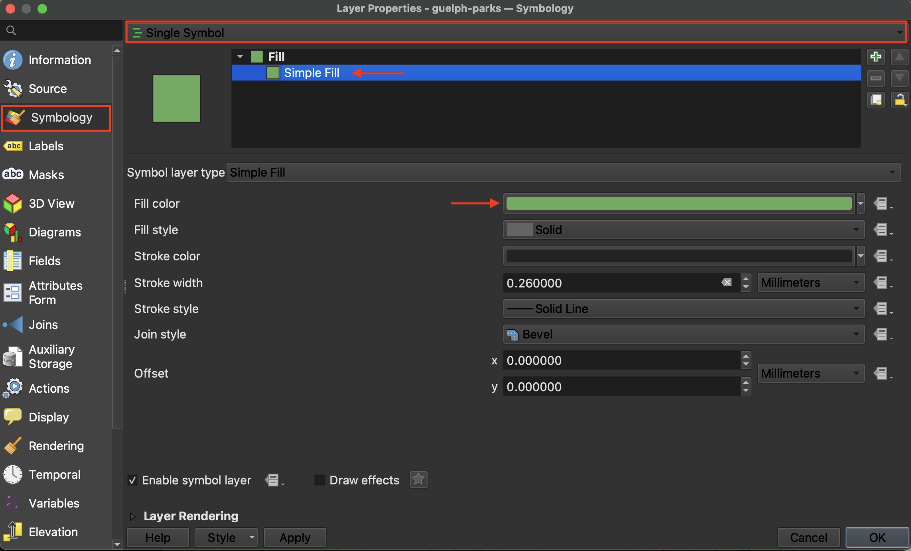

# Layer Properties

In your <code><b>Layers Panel</b></code>, zoom to your parks of choice. 
Control-click (right-click) the layer and open its <code><b>Properties</b></code>.

important --> symbology, joins, crs

## Symbology 
single symbol. 
Change symbology - apply - when content. save. 

