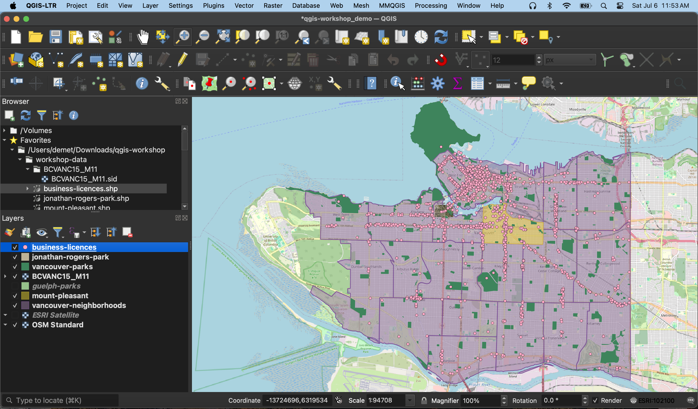
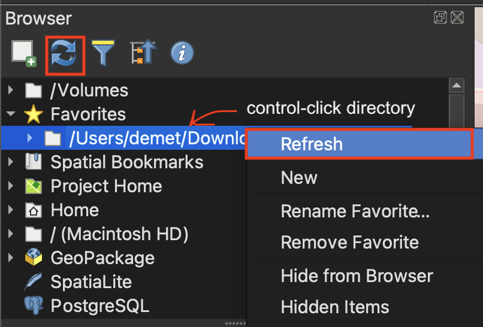
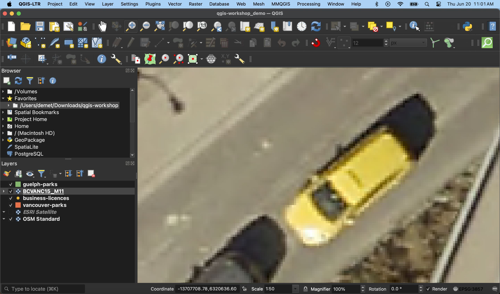

# Loading data to your QGIS Project 
Once you’ve gathered your relevant data, the next step is to add it to a QGIS project. There are a couple ways to add data to your map canvas. 

- **Browser panel** From the Browser panel, likely docked to the left of your screen, expand the `Home` directory (aka folder) and navigate to your workshop data folder. Expand that folder to see the data inside, then double-click or drag and drop each file to add it to your project. Alternatively, you can add a **Favorite** connection in the Browser panel to save you the trouble of finding your data folder. To do this, click “Favorites” at the top of the Browser panel's list and connect the workshop data folder as a favorite directory. Make sure not to click *into*, merely select it. 
- **Data Source Manager** The Data Source Manager is the same sort of portal as the Browser, just in a separate dialogue box rather than a docked panel. You can open the Data Source Manager by double-clicking the 3 colorful squares icon in the Toolbar, or from the Layer menu at the top of your screen.
- **Layer menu** A third way to add layers to your map canvas is through the Layer menu at the top of your screen. Under Layer, navigate to **Add Layer** (it should be the third item down) and select Add Vector Layer... or Add Raster Layer.... This will open the same Data Source Manager dialogue box as before.
- **Drag and drop** files from your data folder directly onto your map canvas.      

     

----
  

## Add Data

To Do
{: .label .label-green }

Add the parks data and aerial image to your QGIS project. Additionally, add `vancouver-parks.shp`, `jonathan-rogers-park.shp`, `vancouver-neighborhoods.shp`, `mount-pleasant.shp`, and `business-licenses.shp` from the workshop folder to your project. `business-licenses.shp` contains restaurants with issued licenses from all of Vancouver [business licenses](https://opendata.vancouver.ca/explore/dataset/business-licences/information/?disjunctive.status&disjunctive.businesssubtype). Ignore any warnings that appear by clicking "okay" or confirming you want to "add layers". Your screen will look something like this...

### Locating Layers
- Layers in your Layers Panel will render in order from top to bottom. If you cannot see a layer added it's likely a) underneath another layer b) invisible or c) out of frame. Locate the layer you want to look at in your Layers Panel and try dragging it to the top of your list. Ensure the box to it's left is checked. You can hide a layer at any time by un-checking the box beside it. If you still don't see it, control-click (right-click) the layer and "zoom to Layer(s)". 
- Sometimes you will might download a new dataset into your data folder but it won't appear in your folder within the Browser Panel. If this happens, try **refreshing** your directory connections in your Browser Panel either by clicking the Refresh icon or by control-clicking the folder in question.
- If you move your data to a different folder location you will get an error when you next open your QGIS Project. Either allow QGIS to auto-find it, connect the new folder location, or move the data back. 

<!--  -->

To Do
{: .label .label-green }
**Zoom to** aerial image of Vancouver. Then, use the magnifying tool (located in your Toolbar) to zoom in until you see the individual pixels. 

    

Before continuing, save your project. 
{: .note}

---
#### Resources for further exploration
- [Exploring the Map View and Toolbar](https://docs.qgis.org/3.34/en/docs/user_manual/map_views/map_view.html#exploring-the-map-view)
- Spatial data is stored in a variety of file formats. See the [QGIS Documentation for Opening Data](https://docs.qgis.org/3.34/en/docs/user_manual/managing_data_source/opening_data.html) to learn more. 