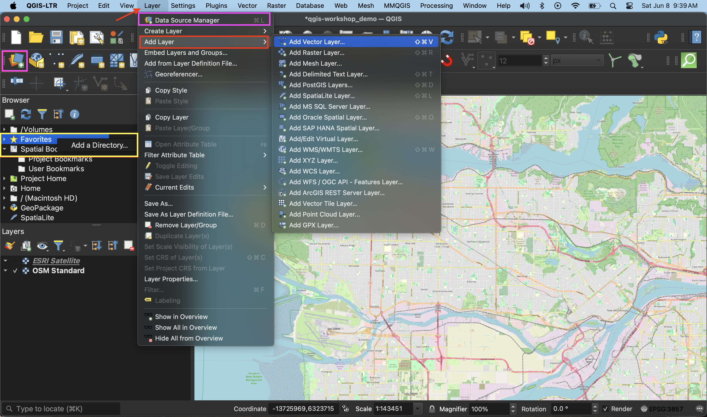
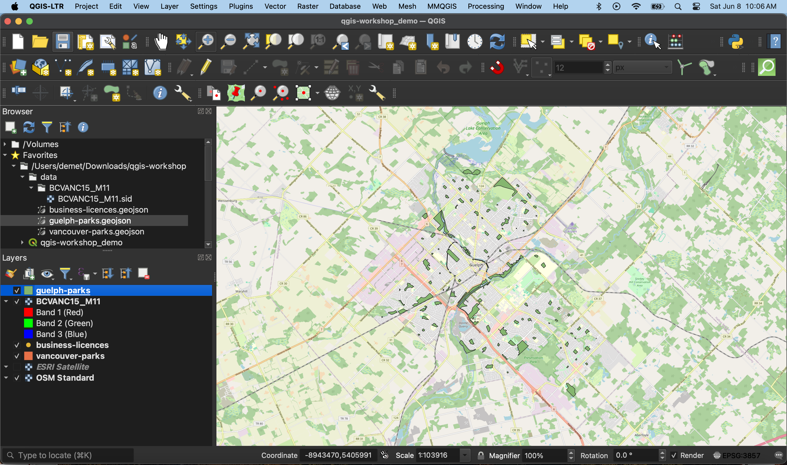

# Loading data to your QGIS Project 
Once you’ve gathered your relevant data you are ready to add it to a QGIS project. There are a couple ways to add data to your map canvas.

- **Browser panel** From the Browser panel, likely docked to the left of your screen, expand the `Home` directory (aka folder) and navigate to your workshop data folder. Expand that folder to see the data inside, then double-click or drag and drop each file to add it to your project. Alternatively, you can add a **Favorite** connection in the Browser panel to save you the trouble of finding your data folder. To do this, click “Favorites” at the top of the Browser panel's list and connect the workshop data folder as a favorite directory. Make sure not to click *into*, merely select it. 
- **Data Source Manager** The Data Source Manager is the same sort of portal as the Browser, just in a separate dialogue box rather than a docked panel. You can open the Data Source Manager by double-clicking the 3 colorful squares icon in the Toolbar, or from the Layer menu at the top of your screen.
- **Layer menu** A third way to add layers to your map canvas is through the Layer menu at the top of your screen. Under Layer, navigate to **Add Layer** (it should be the third item down) and select Add Vector Layer... or Add Raster Layer.... This will open the same Data Source Manager dialogue box as before.
- **Drag and drop** files from your data folder directly onto your map canvas.  
  

<!--note about refreshing browser-->

## Add Data
Add your 3 data layers to your qgis project. Hit okay to any warning dialogue boxes that appear. Your screen will look something like this...

Before moving on, save your project... 
{: .note}
