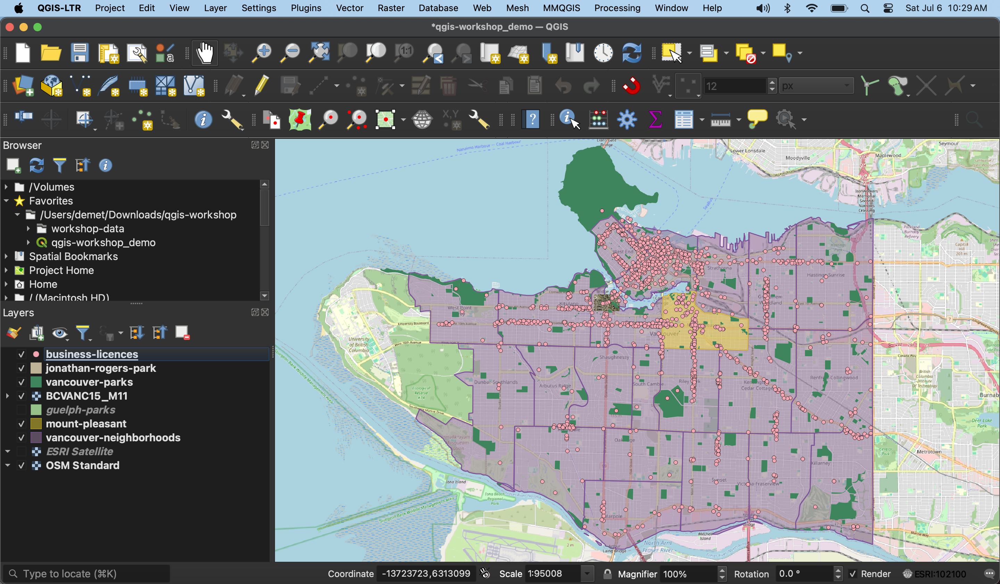
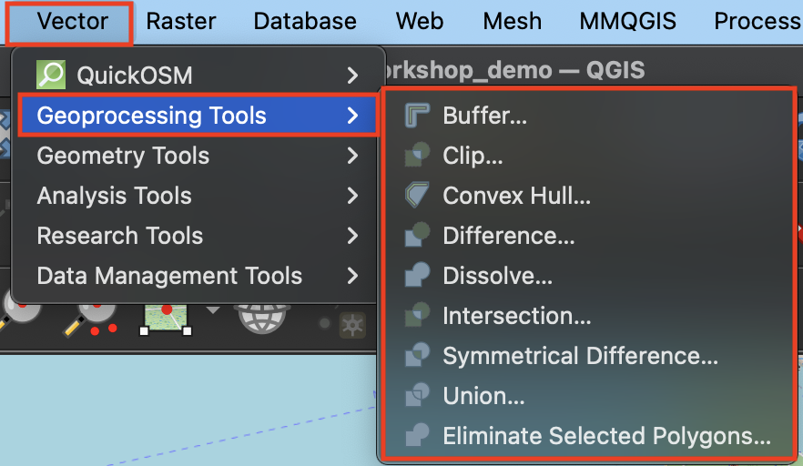
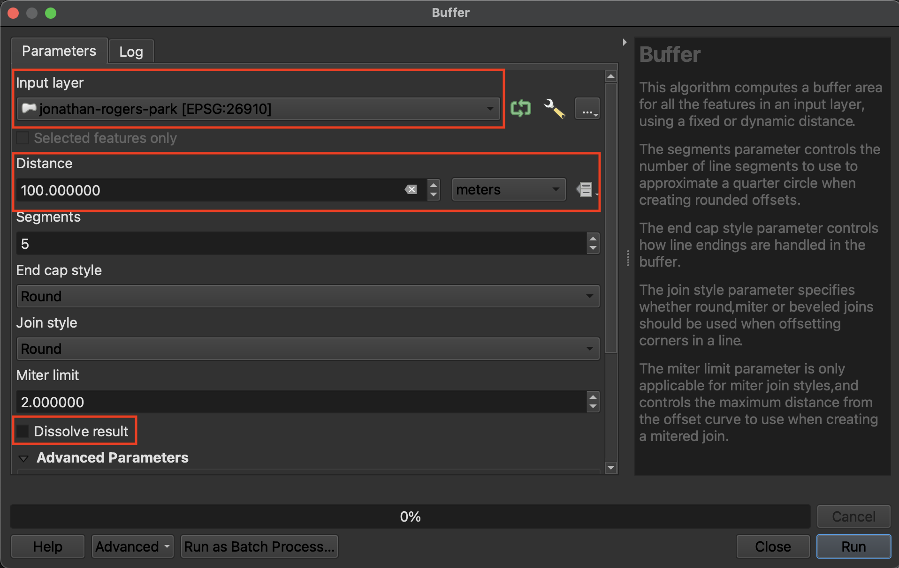
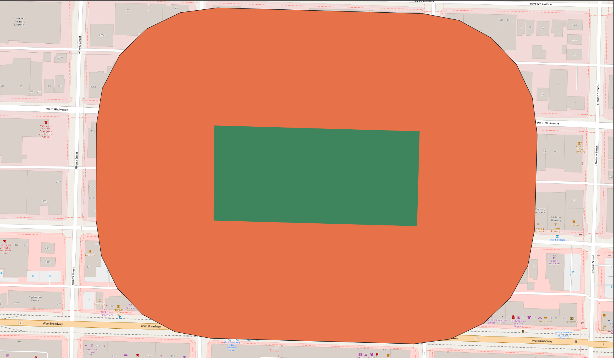
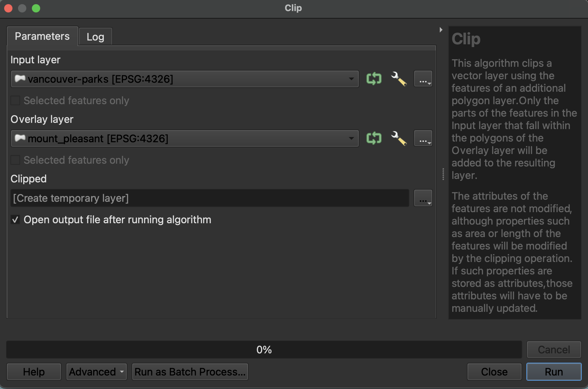
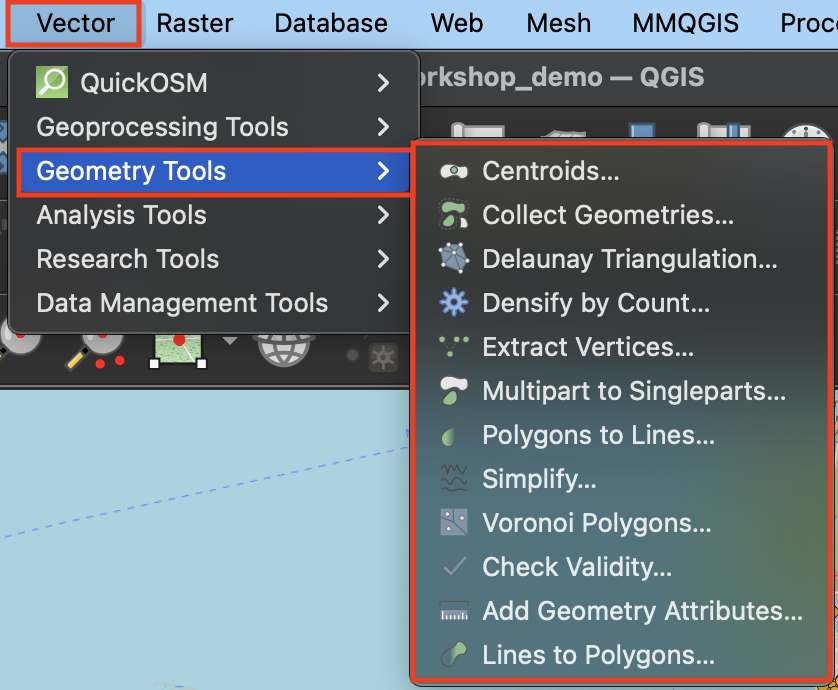
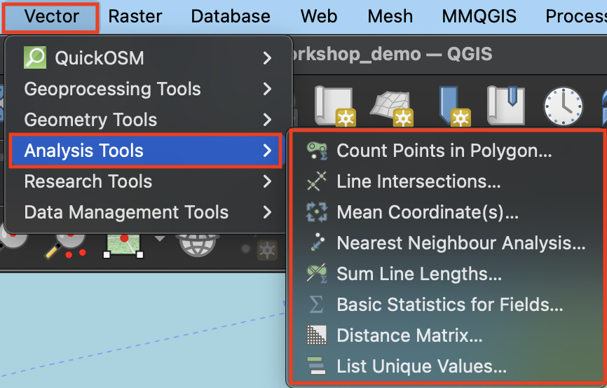
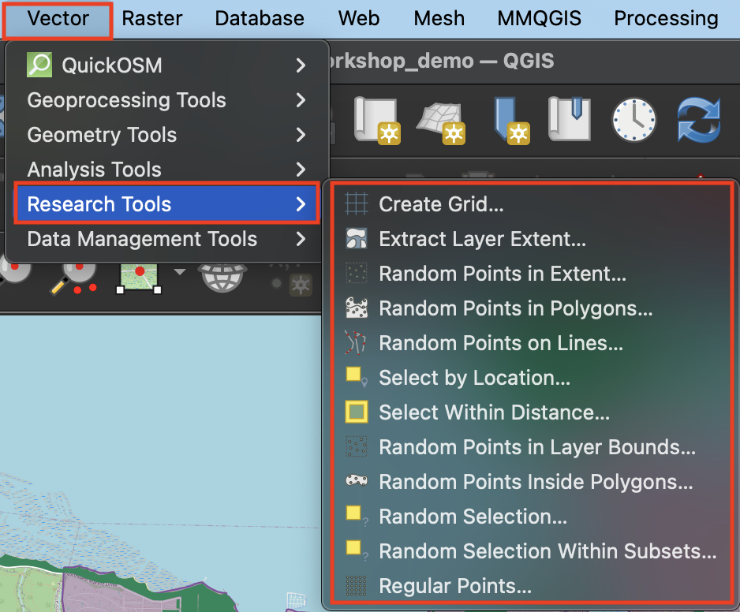
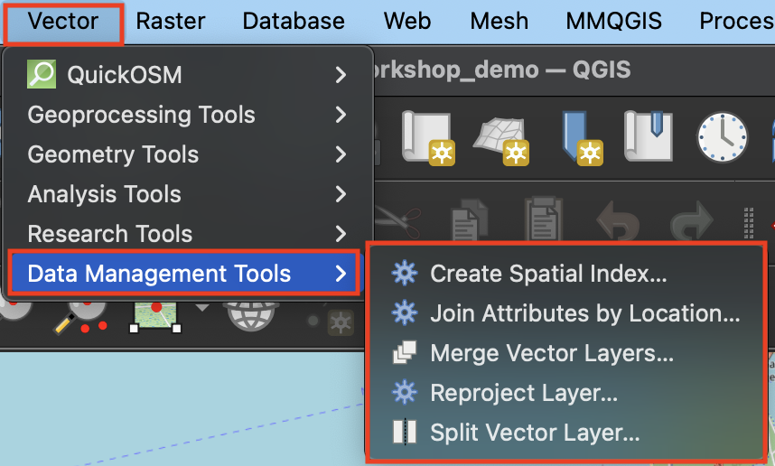

# Vector Tools

This page will introduce some common vector tools for spatial analysis workflows. Vector tools can be accessed from the **Vector** menu, and are grouped by task: Geoprocessing, Geometry, Analysis, Research, and Data Management. You can also search for vector tools (and any other tool, for that matter) by name from the **Processing Toolbox**. The  Processing Toolbox is a panel that can be opened from **Processing** menu at the top of your screen.

Before we begin exploring vector tools, let's get on the same page. Load the following datasets to your QGIS project if not already added, and zoom to Vancouver: `vancouver-parks`,  `jonathan-rogers-park`, and `vancouver-neighborhoods`, `mount-pleasant`, and `business-licences`. Re-order the Layers panel and adjust the layers' symbology until each layer is visible. Your screen will look something like this:
    

     
 
    

  

    Page Contents
  

  {: .text-delta }
 - TOC
{:toc}

## Geoprocessing
Geoprocessing tools are useful for modifying the spatial extent of features, particularly in relationship to other layers. Geoprocessing is often done in the beginning of a QGIS project to prepare the data layers for further analysis. 

Clicking a tool will open a dialogue window specific to that tool. On the right hand side will be a description of what the tool does, and on the left, prompts for selecting input layers as well as saving the output layer to a file. 

To Do
{: .label .label-green }
Buffer 100 meters around `jonathan-rogers-park` 
- Open the **Buffer** tool. The Input Layer is the layer you want to buffer. Note that this layer must be in a projected coordinate system in order to buffer a distance around it. If the layer is in a geographic coordinate system, you will see an error telling you QGIS cannot buffer distance in degrees.
- The **Dissolve** option indicates whether or not you want the buffers of individual features to dissolve if they overlap. 
- The choice to save the output layer as a **permanent** or **temporary** file depends on whether you are running an intermediary step in your workflow. Temporary files will be deleted when you quit your QGIS project, whereas permanent files are new datasets you saved and stored on your computer. For the exercises that follow you can let the output layers remain temporary.  

    

   

To Do
{: .label .label-green }
- Open the **Clip** tool. The **Clip** tool will clip the Input Layer to the extend of the Overlay Layer. 
- For example, clip `vancouver-parks` to `mount-pleasant` to get only parks in the Mount Pleasant neighborhood.

To Do
{: .label .label-green }
**Difference** is like a spatial subtraction. The **Difference** tool creates a layer akin to a spatial subtraction, in that the output layer is the input layer minus the areas where the overlay layer overlaps. How might you use the **Difference** tool to create a donut shape consisting of only the buffered region around Jonathan Rogers Park?

## Geometry
The geometry tools are useful for operations to do with the geometric shape of the feature layer. 

    
To Do
{: .label .label-green }
- **Centroids** will calculate the geometric center of each feature and output a layer consisting of those points. To practice, run **Centroids** on `vancouver-neighborhoods`.

## Analysis
The Analysis cluster contains vector tools for performing basic statistical analysis on layers.
    

To Do
{: .label .label-green }
- **Count points in polygon** will add up the total features in a point layer that fall inside each feature of a polygon layer. The result will be appended to the attribute table of the polygon layer. For example, count the number of restaurants (`business-licences`) in each Vancouver neighborhood. Which neighborhood has the most businesses? 

## Research
The Research cluster of Vector tools --> Selections and generating random points for test scenarios. 
    

To Do
{: .label .label-green }
- Use **Select within Distance** to select all restaurants (`business-licences`) within 1 kilometer of Jonathan Rogers park (`jonathan-rogers-park`). 
- Use **Select by Location** to find all Vancouver parks that are *within* Mount Pleasant. 

## Data Management
The Data Management cluster of Vector tools is useful for modifying the data layer itself. For example, **Reproject** changes the data layer's stored projection

----

# Designing Workflows
Now it's time to put everything you learned together by designing workflows to answer spatial questions. Using the tools above, think through how you might solve for the following... 

*1*{: .circle .circle-purple} Create a layer that visualizes areas of Vancouver that are NOT within 300 meters of a park. 

*2*{: .circle .circle-purple} Which Vancouver neighborhood has the fewest total parks? 

<!-- centroids of parks, count points in polygons (parks) then check attribute table -->

---
#### Resources for further exploration 
- [QGIS Beginner Guide](https://docs.qgis.org/3.34/en/docs/training_manual/vector_analysis/basic_analysis.html)
- [Working with Vector Data in QGIS](https://docs.qgis.org/3.34/en/docs/user_manual/working_with_vector/index.html)
- [Vector Overlay Tools](https://docs.qgis.org/3.34/en/docs/user_manual/processing_algs/qgis/vectoroverlay.html#clip)
